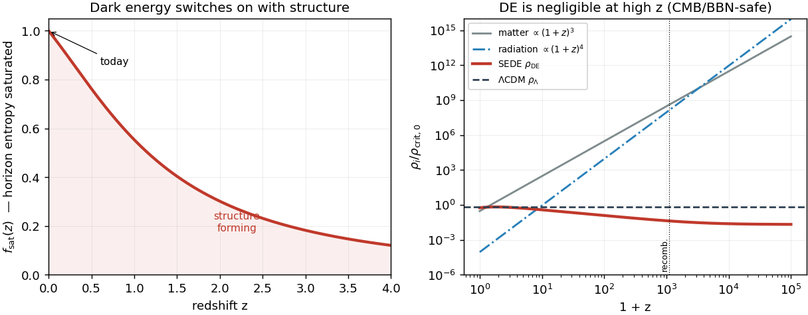
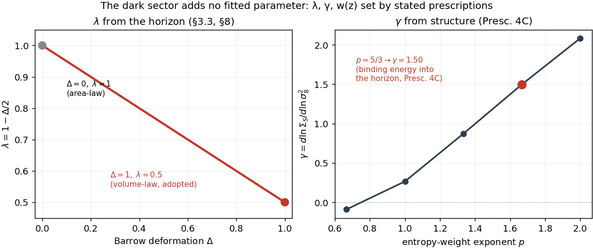
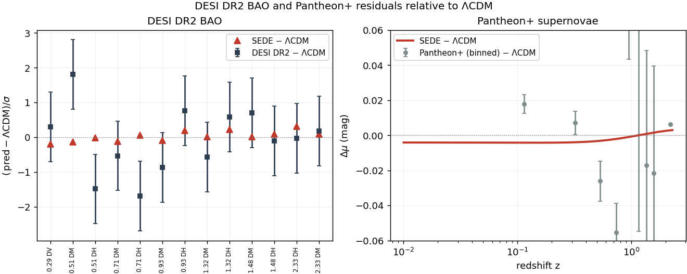
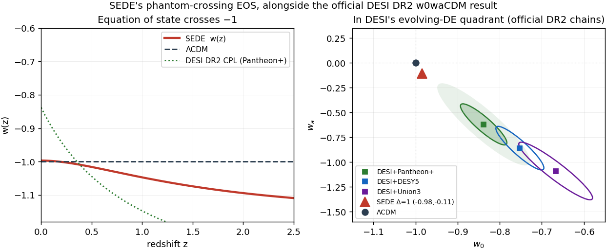
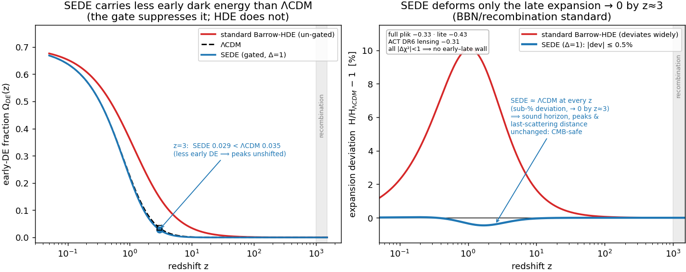
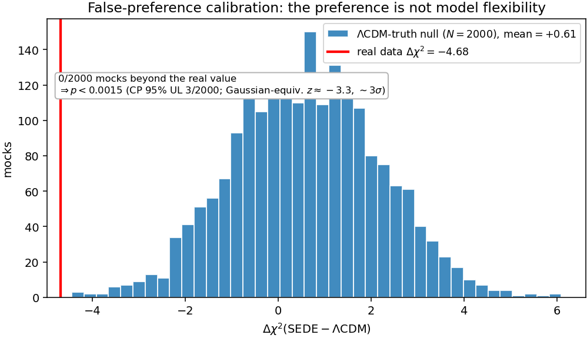
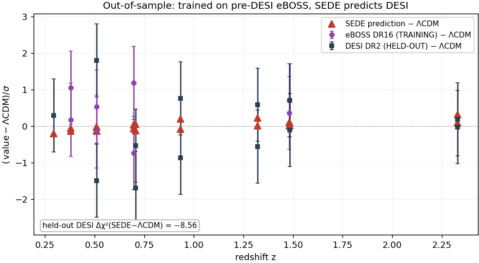
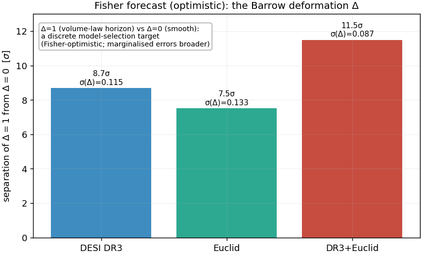
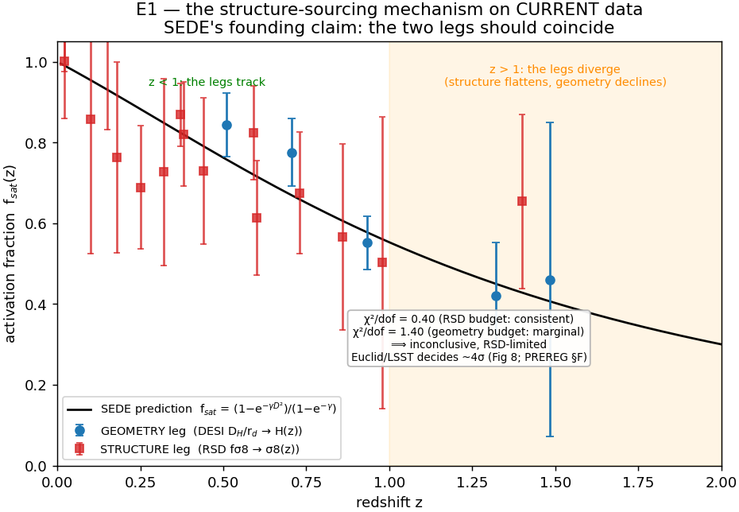
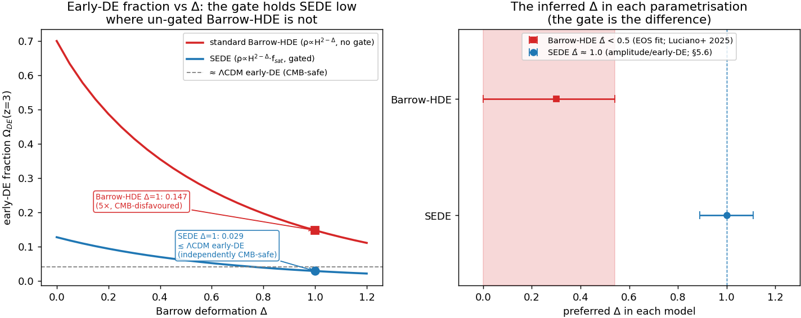

# Structural Entropy Dark Energy: a fixed-parameter, growth-gated holographic dark-energy model without a cosmological constant

*(Appendix A documents the load-bearing results and assumptions — one defining ansatz, fixed
prescriptions, and supporting derivations. Supporting motivations and numerical probes for the
volume-law postulate are collected in the accompanying supplementary material. All quoted numbers are
the verified values from the accompanying code, checked by the verification suite (Appendix B).)*

## Abstract

We present Structural Entropy Dark Energy (SEDE), in which the cosmological constant is replaced by the
thermal energy of the cosmic apparent horizon, ρ_DE = T_AH s_grav f_sat(z), switched on by the growth of
cosmic structure — a dark sector with **no fitted parameter**: the amplitude is fixed by flatness, the
gate shape by a halo-binding prescription (γ ≈ 1.5), and the one discrete postulate is a volume-law
(Barrow Δ = 1) horizon entropy, the quantity our forecasts target. To be explicit about scope, SEDE
modifies *only* the dark-energy density in an otherwise standard-GR Friedmann background (holographic
DE, not modified gravity), with ρ_DE = T_AH s_grav f_sat imposed as an exact ansatz whose equation of
state is a *derived* consequence of energy conservation, not an equilibrium ρ + p = Ts relation. In a marginalised, CAMB-in-the-loop
joint analysis of DESI DR2 BAO, Pantheon+/DES-5YR/Union3 supernovae, cosmic chronometers, fσ8, and
Planck data, SEDE is mildly-to-moderately preferred over ΛCDM (ΔDIC ≈ −3.5 to −4.7;
false-preference-calibrated p < 0.0015, 0/2000 mocks, ∼2–3σ across pipelines, ∼2.3σ without the contested SH0ES
prior), and its *derived* equation of state crosses w = −1 in
DESI's evolving-dark-energy quadrant, (w₀, w_a) ≈ (−0.98, −0.11). A cubic Kinetic-Gravity-Braiding
completion (FPAB, "fixed-point activated braiding") supplies the perturbation sector: c_T = 1, zero
slip, a ∼5% sub-horizon force enhancement, a +2–3% fσ8 boost — the model **raises** growth (σ8 ≈ 0.811
vs 0.800) and makes **no** claim to ease the S8 tension — and a −7.6% low-ℓ ISW suppression. This is a
moderate, calibrated preference, not an established result: the SH0ES-free full-likelihood companion
reads it as *statistically consistent with ΛCDM with a mild pull*, and **if DESI DR3 confirms the DR2
central values, SEDE is disfavoured alongside ΛCDM, not rescued by proximity.** The decisive falsifier
is the discrete entropy index, Δ = 1 versus 0, measurable by DESI DR3 + Euclid at a Fisher-forecast
σ(Δ) ≈ 0.09.

**Keywords —** dark energy theory; dark energy experiments; cosmological perturbation theory; modified gravity.

---

## 1. Introduction

The standard cosmological model, ΛCDM, fits an extraordinary range of data with a cosmological
constant Λ whose value confronts two long-standing puzzles. The **cosmological-constant problem**:
if Λ is the energy of the quantum vacuum, naïve effective field theory overshoots the observed value
by ∼10¹²⁰. The **coincidence problem**: the dark-energy and matter densities are comparable today,
ρ_DE ∼ ρ_m, despite scaling differently with expansion — so we appear to live at a special epoch.
Recent DESI DR1 and DR2 results, moreover, give a mild preference for *evolving* dark energy (w crossing −1)
over a constant Λ [@DESI:2024mwx; @DESI:2024kob; @DESI:2025fii], reopening the question of whether Λ is
fundamental at all and prompting a wave of dynamical-DE model-building — including holographic and
non-equilibrium-thermodynamic constructions [@Li:2024qus; @Bhattacharjee:2025xeb] — within which SEDE's
distinction is a *zero-extra-parameter* w(z) rather than a fitted one.

We approach this through an accounting question. As cosmic structure forms, collapsing halos release
gravitational binding energy, and dark energy activates over the *same* epoch that structure
formation approaches saturation. Is that a coincidence, or is the dark sector tied to structure formation by an energy
ledger? It is tempting to guess that the binding energy released by structure *is* the dark energy —
but a one-line budget settles it: a virialised system has |E_bind|/Mc² ∼ σ²/c², and even clusters
have σ²/c² ∼ 10⁻⁵ (galaxies ∼10⁻⁷), so the binding-energy density is ∼10⁶ times too small to *be*
the observed ρ_DE. The link, if there is one, cannot be an energy supply.

The resolution we propose is thermodynamic. We identify dark energy with the conjugate thermal
energy density of the cosmic horizon — ρ_DE = T_AH·s_grav, the conjugate
energy of the apparent-horizon entropy (motivated by
the horizon thermodynamics of [@Jacobson:1995ab; @Cai:2005ra]) — whose *scale* is the horizon's own,
T_AH s ∼ M_P²H² ∼ ρ_crit, rather than the QFT vacuum (so the vacuum-energy-scale problem is recast,
not inherited) and not structure. What structure supplies is not
energy but **entropy bookkeeping**: by the horizon first law δQ = T dS, the binding-entropy ledger
associated with halo virialisation fixes the *redshift dependence* of the effective activation
fraction f_sat(z) ∈ [0,1], while its amplitude and the f_sat(0) = 1 normalisation are fixed
separately by the horizon-scale normalisation. Energy is conserved throughout — total covariant conservation is automatic,
and the dark-energy fluid is self-conserved — with the binding energy playing a purely entropic,
shape-setting role (§2). The coincidence is then a consequence of the mechanism, not a tuning: dark
energy turns on with a gate whose redshift dependence tracks structure formation as it approaches
saturation, i.e. near "now."

The idea that dark energy is tied to the growth of structure is not new: the coincidence-via-onset framing
traces to backreaction/timescape cosmology, where apparent acceleration switches on as the void/collapse
fraction matures [@Rasanen:2006kp; @Wiltshire:2011ba; @Kolb:2005da] (against which mainstream "why-now"
solutions are the tracker/scaling class [@Zlatev:1998yg]); the *structure-sourced entropic* version
originates with Gough's information dark energy [@Gough2008; @Gough:2011eq; @Gough2025]; and a
contemporaneous phenomenological cousin ties ρ_DE(z) to nonlinear structure and voids
[@Camlibel:2026sjd]. We credit these priorities explicitly. What is specific to SEDE is the *mechanism* (a gravitational horizon-entropy
realisation, ρ_DE = T_AH·s_grav, driven by the gravitational growth factor rather than the baryonic
star-formation history) and a dark sector with no fitted parameter — fixed by stated prescriptions and
one discrete postulate; the relationship is
quantified in §7.

The model is, to a useful approximation, ΛCDM with a cosmological constant that fades in as
structure forms: schematically Λ_eff(z) ∝ f_sat(z) (the exact running term is
3Ω_DE0 H H₀ f_sat, §2), with f_sat running from ≈0 in the early universe to 1
today. By Λ-free we mean specifically that the late-time acceleration is *not* a constant
stress-energy term (p = −ρ = const.) but a self-conserved horizon fluid whose present amplitude is
fixed by flatness (Ω_DE0 = 1 − Ω_m − Ω_r) — exactly as flat ΛCDM fixes Ω_Λ0 — and whose redshift
dependence is set by the horizon/growth prescription rather than held constant; it does *not* mean the
absence of a dark-energy normalisation. Its distinctive feature is that the dark sector adds no
fitted parameter — every input is fixed by a stated theoretical choice (§3), so SEDE has the same
cosmological parameter count as the ΛCDM baseline used in this analysis (the five of the compressed
late-time pipeline of §4). The price
is a single postulate about the quantum-gravitational structure of the horizon (§8), which we make
explicit, plus the accompanying fixed choices (the halo-binding-entropy derivation of γ (Prescription 4C), the smooth-DE
closure c_s²=1), which we flag as such rather than as derivations.

This paper is organised around the energy ledger. §2 states the model and establishes energy
conservation as its backbone, fixing the (entropic, not energetic) role of binding energy; §3 fixes
the dark-sector inputs — the structure coupling γ from the halo-binding-entropy derivation (Prescription 4C), then w(z), λ, and the sound
speed c_s² — separating the horizon-set *magnitude* from the structure-set *shape*. §4 describes the
data and the CAMB-in-the-loop methodology; §5 presents the results, including a false-preference
calibration and out-of-sample tests; §6 gives the falsifiable predictions; §7 the relation to dark
matter and other sectors. §8 then supplies the quantum-gravity underpinning — the magnitude scale and
the maximal deformation — and isolates the one irreducible postulate; §9 discusses the open problems
and §10 concludes. Throughout we maintain that SEDE is a *falsifiable proposal*, preferred at a moderate
level, not an established result.

---

## 2. The SEDE model and energy conservation

SEDE is general relativity with a single extra fluid: a horizon-fluid dark-energy density identified
with the conjugate thermal energy density of the cosmic apparent horizon. We stress the scope at the
outset: the horizon entropy sources only ρ_DE and never the Friedmann equation itself, so the
construction is *holographic* dark energy — not entropic or modified gravity — and the Barrow exponent
Δ multiplies a component that f_sat gates to a negligible fraction at early times, leaving H(z), the
sound horizon r_drag, and hence the modified-gravity Barrow/BBN bounds untouched. (In Barrow
*modified-gravity* cosmology, by contrast, the same first law is applied to derive the background itself,
giving H^{2−Δ} ∝ ρ [@Saridakis:2020zol]; that is deliberately *not* the construction here — the Barrow
deformation enters ρ_DE alone.) Correspondingly,
ρ_DE = T_AH s_grav f_sat is imposed as an *exact effective relation* that fixes the dark-energy
density's amplitude and its H-scaling; the equation of state is then a derived, kinematic consequence
of energy conservation on that standard background (it crosses w = −1 by *sourcing*), not the
equilibrium enthalpy relation ρ + p = Ts, which does not hold for this open, structure-fed sector. The whole construction is governed by one bookkeeping rule — that energy is conserved when
this fluid's redshift dependence is gated by structure growth. We first state the model (the conjugate horizon-fluid ansatz, the structure
gate, the Friedmann equation, and how Λ is replaced), and then make energy conservation the backbone:
it is what fixes the role of structure's gravitational binding energy as *entropic*, not energetic, and
what shows the w = −1 crossing to be sourcing rather than a phantom field.

The conjugate horizon-fluid ansatz. At the cosmological apparent horizon R_AH = 1/H (flat FRW),
the dynamical Cai–Kim temperature is T_AH = (H/2π)(1 − ε/2), ε ≡ −Ḣ/H². For the dark-energy sector,
which tends to a de Sitter attractor (ε → 0), we adopt the Gibbons–Hawking temperature T_AH = H/2π
— the ε → 0 limit, i.e. the appropriate *leading* temperature for a slowly-evolving horizon fluid. This
is an approximation, made deliberately: the dynamical (1 − ε/2) correction is largest in the matter era,
exactly where f_sat → 0 and dark energy is negligible, and including it in full on the volume-law fluid
is in fact *disfavoured* — it yields an unstable, phantom-everywhere background with no w = −1 crossing
(§6). So T_AH = H/2π is the physically-appropriate choice for this sector and
it is what enters the calibrated E(z). We are explicit about the epistemic status of this step: the
Gibbons–Hawking form is a *convention selected* in part by the failure of the dynamical alternative, so
quantities downstream of it — notably the w = −1 crossing redshift (§6) — are convention-conditional
outputs of the adopted temperature, not convention-free predictions. We *identify* the dark-energy density with the conjugate
horizon-fluid energy density,
$$\rho_{\rm DE} = T_{AH}\, s_{\rm grav}\, f_{\rm sat}(z),$$
where s_grav is the gravitational entropy *density* and f_sat is an effective horizon-entropy
activation gate, normalised to f_sat(0) = 1 — i.e. a value *relative to today*, not a literal
fraction bounded by 1 (it reaches ≈ 1.23 in the future, below); its redshift dependence is set by the
growth-weighted halo prescription of §3.1, not derived from the Bousso bound itself. *Range and future behaviour (defining the
convention explicitly):* for z ≥ 0 — the regime of every data fit here — the linear growth obeys
0 ≤ D(z) ≤ 1, so 0 ≤ f_sat ≤ 1. f_sat is not clipped; in the future (z < 0) linear growth *saturates*
(D freezes at D_∞ ≈ 1.44 as dark energy suppresses growth — it does not run away), so f_sat saturates to a
finite de Sitter value f_sat(D_∞) ≈ 1.23 (modestly above 1, never reaching the formal x → ∞ ceiling
1/(1−e^{−γ}) ≈ 1.29). The background tends to a de Sitter attractor (H → H_∞, ρ_DE → const, w → −1; A.7,
Result 12) — bounded and well-defined for all z, with the ≤ 1 statement specific to z ≥ 0. (The gate is
normalised to its present value; it is *not* the literal fraction of horizon entropy deposited by
collapsed structures, which is far smaller — ∼10⁻⁷; App. F.) Clausius horizon thermodynamics motivates the relation and
supplies the conservation logic, but the absolute identification is the defining SEDE ansatz (App. A.1).
To be precise about a distinction used throughout: the relation ρ_DE = T_AH·s_grav·f_sat is *imposed as
an exact relation* of the effective description — that is what lets the reservoir argument (§3.1) and the
free-energy step (App. A.6) use it — while "postulate" refers to its lack of a *microscopic* derivation
(the horizon-entropy density is not derived from a quantum-gravity state count), not to any looseness in
how it is applied. We take s_grav to be the coarse-grained entanglement entropy in the
apparent-horizon volume, S_grav ∝ V_AH ∝ R_AH³ — equivalently a *constant* entropy density
s_grav = s_0 (in contrast to the Bekenstein–Hawking area-law density s_AH ∝ H). With T_AH ∝ H,
$$\rho_{\rm DE} = T_{AH}\,s_0\,f_{\rm sat} \;\propto\; H\,f_{\rm sat}, \qquad
s_0 = \frac{\Omega_{\rm DE0}\,\rho_{\rm crit,0}}{T_{AH,0}}\ \text{(fixed by flatness)},$$
giving ρ_DE ∝ H f_sat with no free parameter. This volume law is exactly the maximal Barrow
deformation (S ∝ A^{1+Δ/2} = A^{3/2} = R³ at Δ=1, λ = 1 − Δ/2 = 1/2); we keep Δ only as a *test*
parameter quantifying deviations from the volume law (§8, and the data measurement of Δ), not as a
model input.

Beyond the Barrow characterisation, there is a *plausibility ordering* for the volume law that needs no entropy
maximisation (we stress at the outset that it is an ordering, not a selection principle). Expanding the vacuum response to the cosmic expansion scalar Θ = 3H as a derivative
series ρ_DE ∝ Θ^{2−Δ}, the constant term (Δ=2) is a cosmological constant, the quadratic term (Δ=0) is
the area law, and the linear term (Δ=1) is the unique *time-reversal-odd* — hence dissipative,
entropy-producing — response. This is also why the linear power is not the covariant-vacuum "red flag"
it can appear to be: a *covariant* vacuum energy is invariant under H → −H and so admits only even powers
(the running-vacuum program's ρ_DE ∝ H² + H⁴ [@Basilakos:2012ra]); SEDE's odd, linear term is not a
covariant vacuum energy but the T-odd dissipative response of the apparent horizon, so the broken
H → −H invariance is the *signature* of entropy production, not a covariance violation. Because SEDE
admits no bare Λ, the leading surviving response is the
linear one, so Δ=1 is the leading dissipative response *provided* the higher, time-reversal-even
Θ² (area) term is subdominant — a plausibility ordering that ranks Δ=1 above Δ=0, not a selection
principle (dimensionally, ranking Θ¹ above Θ² requires the Θ² coefficient to be sub-Planckian, an
input we do not derive; Δ=1 remains a postulate tested by the data, §5.6, §8.4).
Equivalently, ρ_DE ∝ H f_sat is a structure-gated bulk viscosity, ζ = ρ_DE (d ln f_sat/d ln a)/(9H) > 0
(second-law-respecting), so the w = −1 crossing is a viscous–dilution balance rather than a phantom
kinetic term. The *ungated* H-linear form is itself not new: entropic cosmology derives an
H-linear driving term from a volume (Tsallis–Cirto) horizon entropy, explicitly analogized to bulk
viscosity [@Komatsu:2015nkb; @Komatsu:2012zh] (whereas the area-law entropic-force term is H², not H
[@Easson:2010av; @Basilakos:2012ra]); the *same* H-linear law is reached from an entirely different
route — QCD topological (Veneziano contact-term) vacuum energy, ρ ∝ H·Λ³ [@Urban:2009vy; @Urban:2009yg; @Ohta:2010in],
the hidden-sector version of which the scale-sector companion uses to source μ³H — so that ρ ∝ H arises
from horizon thermodynamics and from QCD contact terms alike is a convergence, not a coincidence. What is
specific to SEDE is the structure gate f_sat, the
zero-fitted-parameter closure, and the derived w(z) — not the ρ_DE ∝ H scaling per se. Ghost DE leaves the
amplitude α free and Barrow holographic DE leaves the exponent Δ free; SEDE fixes both (Δ = 1 from the
capacity theorem of the count companion, the amplitude by flatness) and multiplies by the derived gate,
so it is the ungated, free-amplitude limit of SEDE that reproduces those models, not the reverse. A density linear in H cannot descend from a local conservative action, so the
mechanism is intrinsically dissipative; its covariant completion is a braided (kinetic-gravity-braiding)
or Schwinger–Keldysh dissipative-fluid theory (§7). We flag the status honestly: a *single* bulk-viscous
fluid is in fact gradient-unstable across the crossing (the principal-symbol speed uses the total
enthalpy (1+w)ρ_DE, which changes sign), so stability requires the positive kinetic structure that
braiding supplies — demonstrated for a computed KGB member but conditional on a shift-charge tuning;
the completion is not yet closed (§7, and the dissipative-stability analysis in the reproduction repo).

**The structure gate.** Structure formation supplies the *redshift dependence* of the activation gate
at a rate set by the collapsed-halo abundance (Result 3, App. A), yielding a closed form for the
normalised activation fraction,
$$f_{\rm sat}(z) = \frac{1 - e^{-\gamma D^2(z)}}{1 - e^{-\gamma}}, \qquad D(z)\ \text{the linear growth factor},$$
where D(z) is the model's self-consistent growth factor (computed with SEDE's own E(z), which in
turn depends on f_sat — the background is solved as the joint fixed point; §4.4, App. B).
with f_sat(0) = 1 imposed as the present-day normalisation convention and f_sat → 0 at high z. The
single shape parameter γ is fixed by a halo-binding-entropy derivation (§3.1, Prescription 4C), not fitted.
One property of the gate deserves plain statement: because its argument is the normalised growth
*ratio* x = D²(z) = σ8²(z)/σ8²(0), the gate is independent of the absolute structure amplitude — a
universe with four times the primordial power (A_s) has the identical f_sat(z). What activates dark
energy is the relative *maturation* of the growth history, not the accumulated amount of structure; the
phrase "structure activates dark energy" is to be read in this shape (not amount) sense throughout.

**The Friedmann equation.** Inserting ρ_DE into the (unmodified) Friedmann constraint gives a single
fixed-point equation for the dimensionless expansion rate E = H/H₀:
$$\boxed{\;E^2(z) = \Omega_m(1+z)^3 + \Omega_r(1+z)^4 + \Omega_{\rm DE0}\, f_{\rm sat}(z)\, E(z)\;}$$
(for λ = 1/2, so E^{2λ} = E). The boxed closure equation is the entire background model. It is ΛCDM with the
constant Λ replaced by the structure-gated, horizon-coupled term Ω_DE0 f_sat(z) E(z); at z = 0 with
f_sat = 1 it reproduces the observed Ω_DE0 = 1 − Ω_m.

Replacement of Λ in the field equations. SEDE is *holographic dark energy* (the programme founded by
Li [@Li:2004rb], with the density set by an entropy bound at a cosmological length), not modified gravity:
the Einstein tensor and Newton's constant are untouched, and the deformation enters only a smooth
(c_s² = 1; §3.4) perfect fluid on the right-hand side,
$$G_{\mu\nu} = 8\pi G\,(T^{\rm (matter)}_{\mu\nu} + T^{\rm (DE)}_{\mu\nu}),\qquad
\rho_{\rm DE} = \tfrac{3}{8\pi G}\,\Omega_{\rm DE0}\, H H_0\, f_{\rm sat},\quad p_{\rm DE} = w(z)\rho_{\rm DE}.$$
Equivalently, Λ becomes a *running* scalar Λ_eff(z) = 3 Ω_DE0 H H₀ f_sat that equals the observed Λ
today and is negligible in the early universe (Figure 1). The choice of right-hand side (fluid) over left-hand side
(geometry) is not cosmetic: a Barrow-*modified-gravity* Friedmann equation would rescale the
early-universe expansion by (M_P/H)^Δ ∼ 10⁶¹, a Big-Bang-nucleosynthesis catastrophe (§8, Result 11).
Keeping the deformation in the dark-energy fluid leaves the early universe exactly standard.

**Energy conservation.** Because SEDE is general relativity with a fluid source, the Bianchi identity
$\nabla^\mu G_{\mu\nu}=0$ forces the total stress–energy to be covariantly conserved,
$\nabla^\mu(T^{(\rm matter)}_{\mu\nu} + T^{(\rm DE)}_{\mu\nu})=0$, identically — there is no violation. At
the background level matter dilutes standardly, ρ_m ∝ a^{−3}, and dark energy is a self-conserved
fluid whose density evolves entirely through its own pressure work,
$$\dot\rho_{\rm DE} + 3H\,(1+w_{\rm DE})\,\rho_{\rm DE} = 0, \qquad
w_{\rm DE}(a) = -1 - \tfrac13\,\frac{d\ln\rho_{\rm DE}}{d\ln a}$$
(the w(z) of §3.2 and Fig. 4). At the background level this "self-conservation" is definitional — for
any prescribed ρ_DE(a) one *defines* w(a) by the second equality to satisfy continuity — so the
non-trivial content is not background conservation but the existence of a local action whose
equations of motion produce this w(a) without an external matter coupling; that is what the FPAB
completion (§7) supplies, and it is trajectory-level, not yet closed. There is no literal energy transfer from matter to dark energy: such a
transfer of order ρ_crit over a Hubble time would spoil ρ_m ∝ a^{−3} and with it BBN and the CMB. This is
the crucial accounting point of the model. The magnitude of ρ_DE is anchored to the horizon
gravitational scale ∼ M_P² H² ∼ ρ_crit through the CKN bound and the flatness normalisation (§8.2),
not to energy borrowed from structure: the gravitational
binding energy released as halos virialise (E_bind ∝ M^{5/3}) is ∼ σ²/c² ∼ 10⁻⁶ of the collapsed
rest-mass energy, six orders of magnitude too small to *be* the dark energy. This makes the genuinely
new content precise: with the area law (Δ=0) the ratio ρ_DE/ρ_crit ∝ H^{−Δ} is a fixed fraction that
merely tracks — GR's own horizon energy repackaged (Jacobson) — whereas the Barrow deformation Δ>0
makes it grow as H falls, turning a tracking term into dark energy that comes to dominate; the new
physics is *entirely* the deformation ("is the energy new?" ⟺ "is Δ≠0?"). What structure formation
supplies is therefore not energy but **entropy bookkeeping**: by the apparent-horizon first law (A.1),
the deposited binding entropy ΔS_AH = E_bind/T_AH fixes the *weight* p = 5/3 that sets the shape γ of the
gate f_sat (§3.1) — it determines *when* and *how sharply* dark energy turns on, while the overall scale,
and the normalisation f_sat(0) = 1, come from the horizon (§3, §8). Read this way, SEDE's crossing of
w = −1 is not a phantom field — there is no negative kinetic term or gradient instability — but the
pressure work of a horizon-sourced fluid whose density rises as f_sat grows (Result 13: 1 + w is the horizon
entropy-production rate). (A single canonical or k-essence field cannot cross w = −1 without its kinetic
term ρ + p = 2X·P_X passing through zero — the Vikman no-go — so a fundamental-field description would
require a ghostly quintom; SEDE avoids this because its phantom is *effective*: ρ_DE = T_AH·s_grav is
built from covariant horizon scalars, not a fundamental scalar.) Finally, since f_sat is a functional of the *background* growth (c_s² = 1,
§3.4), the coupling lives at the background level only and introduces no local energy non-conservation in
the perturbations.


**Figure 1.** The mechanism. *Left:* the effective activation fraction (structure-growth gate) f_sat(z) rises toward 1
today as structure forms, activating the dark-energy gate — the effective running term Λ_eff = 3Ω_DE0 H H₀ f_sat
*fades in* (computed from the model's self-consistent linear growth factor D(z), §2). *Right:* the cosmic density inventory; SEDE's
ρ_DE is orders of magnitude below matter and radiation at high z and falls below ΛCDM's constant ρ_Λ,
so the early universe (BBN, recombination) is standard — the deformation acts only on the late-time
dark-energy fluid.

---

## 3. Fixed inputs: why the dark sector adds no fitted parameter

In flat ΛCDM the dark-energy amplitude Ω_Λ0 = 1 − Ω_m − Ω_r is itself fixed by the flatness closure,
not an independent fit; SEDE keeps exactly this — no independent dark-energy amplitude beyond flatness
— and differs only in that the *redshift dependence* is set by the horizon/growth prescription rather
than held constant. What that prescription fixes is the triplet (γ, w(z)-shape, λ) plus the sound
speed c_s² — and each is fixed by a stated theoretical choice (not fitted to cosmological data),
so SEDE adds no free dark-energy parameter. We are explicit about the status of each choice below
(some follow from flatness or the model construction; others, notably γ and c_s², are fixed
prescriptions). The choices separate along the two scales of §2. The magnitude of dark energy is
the horizon scale, ∼ M_P²H² ∼ ρ_crit (the CKN bound normalised by flatness, §8.2) — not a fitted
dark-sector parameter. What the choices control is the **shape**: *when* and *how sharply* that energy
turns on. We therefore lead with the structure
coupling γ — the shape, set by the binding energy — and then give w₀, λ, and c_s² (Figure 2).

### 3.1 The structure coupling γ ≈ 1.5 from a halo-binding-energy derivation (Prescription 4C)
γ sets the sharpness of the structure gate, γ = d ln Σ_S / d ln σ8² with Σ_S the entropy-weighted
collapsed mass, Σ_S = ∫ M^p (dn/d ln M) d ln M — the derivative is with respect to the variance
σ8² because the gate's argument is x = D² = σ8²(z)/σ8²(0) (§3.4, A.2); equivalently γ = ½ d ln Σ_S/d ln σ8. The weight exponent p is fixed by *where* the
structure-formation entropy is deposited — and the reservoir is fixed *before any data enter*, by the
model's own §2 identity. Because SEDE identifies ρ_DE = T_AH·s_grav (§2), f_sat is by construction
the cosmic-*horizon* entropy activation fraction (A.1), so the binding energy released by virialisation
is accounted in the horizon ledger at its temperature T_AH ∝ H — *not* the halo's internal virial
temperature T_vir ∝ M^{2/3}. With T_AH mass-independent at a fixed epoch, the Clausius relation gives
ΔS_AH = E_bind/T_AH ∝ E_bind, and the virial binding energy E_bind ∝ M^{5/3} then fixes p = 5/3.
This reservoir choice follows from the §2 identity, and we state its history plainly rather than
calling it forced: an initial treatment used
T_vir (giving p = 1), a reservoir error corrected for consistency with §2, not a tuning —
but the correction is a discrete modelling revision, made after the p = 1 mis-step. We flag the
epistemic risk plainly: the revision post-dates the p = 1 attempt and lands on the data-consistent
value, so — absent a demonstrated microphysical transport channel depositing the binding heat on the
horizon (which we do not claim; below) — p = 5/3 is a prescription whose consistency with the data is a
check, not a uniquely forced output. What makes it more than post-hoc is that the reservoir (horizon,
T_AH, not virial T_vir) is fixed by the §2 relation independently of any fit; the residual freedom is
whether that relation is the right accounting, not the value of p given it.

γ has a transparent closed form. A self-similar reduction gives γ = (p − 1)⟨1/α⟩_Σ (α ≡ −d ln σ/d ln M
the effective spectral slope, ⟨·⟩_Σ the entropy-weighted average), which reproduces the full
mass-function integral to 0.1% (A.3) — so the dark-sector input is *only* p = 5/3, with ⟨1/α⟩
ordinary halo physics. The *numerical* γ then follows from a standard, pre-specified halo model and
inherits its systematics: a Sheth–Tormen mass function over 10¹⁰–10¹⁶ M⊙ with an EH98 transfer gives γ = 1.50
(Prescription 4C), and varying the mass function (Press–Schechter, Tinker08, Despali16, Watson13), mass
range, and transfer function spans γ ∈ [1.14, 1.60] (median 1.50),
dominated by the mass-range low-cutoff and robust (1.48–1.57) to the mass-function and transfer choice.
We therefore claim precisely: the reservoir — hence the weight p = 5/3 — is fixed by the model's own
construction; the numerical γ ≈ 1.5 carries standard halo-model systematics of order ±0.2, none
tuned to cosmological data. That it lands near the diagnostic-fit value is then a *consistency check*,
not the motivation. (We do not claim a demonstrated microphysical transport channel depositing the
binding heat onto the horizon; the prescription is the accounting, and the smooth-DE closure of §3.4
ensures it induces no local dark-energy perturbation.) Binding energy thus sets the gate *shape*, not
the magnitude (§2, §10 ledger).

### 3.2 The equation of state w(z) from the fixed background, conservation, and flatness
The model has a single physical equation of state — that of the canonical fixed-point background
(the boxed Friedmann equation of §2), obtained from energy conservation,
$$w(z) = -1 - \tfrac13\,\frac{d\ln\rho_{\rm DE}}{d\ln a},$$
with ρ_DE = Ω_DE0 ρ_crit,0 E f_sat and the present-day normalisation fixed by spatial flatness
(Ω_DE0 = 1 − Ω_m − Ω_r, f_sat(0) = 1). Evaluated on the self-consistent background this gives
w₀ ≈ −1.0, crossing −1 at low redshift (z ≈ 0.2) and dipping to ≈ −1.08 by z ≈ 2 — DESI DR2's
thawing/crossing quadrant. So w(z) is fixed by Ω_m (through the background) with no free EOS
parameter; this is the w(z) used throughout (§5, Fig. 4). *(Convention: the literal present-day value is
w(z=0) = −0.996; the reported pair (w₀, w_a) ≈ (−0.98, −0.11) is the CPL projection of this same w(z)
over 0 < z < 1 — the range used by the locked `predictions.json`. The CPL w_a steepens if fit over a
wider range, e.g. −0.17 over 0 < z < 2, so the fit window is quoted with the pair.)* Three w₀ values appear in this paper for *different* objects; to avoid confusion:

| object | scaling | role | w₀ |
|---|---|---|---|
| canonical SEDE | ρ_DE ∝ H f_sat | the actual model | ≈ −1.0, crosses −1 |
| λ=1 "temperature-factor" variant | — | closed-form structural estimate (side note) | ≈ −0.85 |
| area-law branch | ρ_DE ∝ H² f_sat | disfavoured diagnostic alternative (§5.6, §8.1) | ≈ −0.49 |

Only the first row is the model's prediction; the −0.85 is a sanity check on the Ω_m-dependence
(closed form w₀ = (4Ω_m/3 − 1)/(1 − Ω_m)) and the −0.49 is the Δ=0 alternative the data disfavour.

### 3.3 The H-coupling λ = 0.5 from the horizon's volume entropy
λ fixes the *magnitude*'s scaling with H, with no free parameter: the gravitational entropy is taken
to be the coarse-grained entanglement entropy in the apparent-horizon volume, S_grav ∝ V_AH ∝ R_AH³,
i.e. a *constant* horizon entropy density. The conjugate horizon-fluid ansatz (ρ_DE = T_AH·s_grav,
T_AH ∝ H) then gives ρ_DE ∝ H ≡ H^{2λ} with λ = 1/2 — no deformation parameter. Equivalently, in the
Barrow language S = (A/A₀)^{1+Δ/2} this is the maximal deformation Δ = 1 (s_AH ∝ H^{1−Δ}, λ = 1−Δ/2):
the volume law *is* Δ=1 (A^{3/2} = R³ = V). We keep Δ only as a falsifiable test of the volume
law (its data measurement, §5/§6), not as a model input; §8 motivates the volume/space-filling state
(capping Δ≤1 and postulating saturation). (Verified Δ-free ≡ Δ=1 bit-for-bit.)

### 3.4 The perturbation sector: from a smooth-fluid closure to the FPAB-SEDE cubic-KGB action
SEDE's dark energy is *background-growth-gated* (its f_sat depends on the growth history), which might
suggest it clusters with structure. The minimal treatment adopts a **smooth-dark-energy closure**: f_sat is a
functional of the background growth factor D(z) — a function of cosmic time only — so the structure
coupling is background-level / nonlocal / coarse-grained, not local, ρ_DE is homogeneous by construction,
and the dark energy has the standard metric-driven response with c_s² = 1. That closure is a *modelling*
choice, not a theorem, and it is the sub-horizon (`c_s²=1`) limit of the completed theory rather than the
theory itself.

**The completed perturbation sector (FPAB-SEDE).** The background $\rho_X = \mu^3 H\,g(a)$ (with
$g$ the growth-shaped gate, §2) admits a local, luminal **cubic Kinetic-Gravity-Braiding** completion,
$\mathcal{L} = M_{\rm P}^2 R/2 + K(X,\phi) - G_3(X,\phi)\,\Box\phi$, whose finite (16-coefficient) action
reproduces the background to $\max|\delta H/H| \approx 2\times10^{-4}$ over $0 \le z \le 99$; we call this
completed effective theory **FPAB-SEDE** (fixed-point activated braiding). This is a trajectory-level
completion — an instance of designer / EFT-of-dark-energy reconstruction [@Kennedy:2017sof; @Gubitosi:2012hu; @Gleyzes:2014dya]
rather than a symmetry-derived Lagrangian — delivered in the stable $\alpha$-basis [@Bellini:2014fua]
to mochi-class [@Cataneo:2024uox; @Zumalacarregui:2016pph], with braiding $\alpha_B = b\,\Omega_X$ the
standard density-tracking ansatz and the cubic-KGB no-ghost/no-gradient structure of
[@Deffayet:2011gz; @Kobayashi:2011nu]. Because it carries no
$G_4/G_5$ term, $\alpha_M = \alpha_T = 0$ and $c_T = 1$ exactly (GW170817-safe). This is a *derived*
statement, not merely an EFT prior: an exact all-orders-in-the-tensor-perturbation expansion of the
FPAB action shows that $K$ and $G_3$ contribute nothing to the quadratic tensor action for arbitrary
functional forms, so the entire tensor sector is that of GR and the GW and EM luminosity distances
coincide ($\Xi_0 = 1$ exactly) — see the tensor-sector and standard-siren predictions in §6 (script
`fpab_tensor_sector.py`). Its perturbations are
solved *dynamically* (Mochi-CLASS, not a PPF or an imposed sound speed): ghost- and gradient-stable, with
$$c_s^2 \in [0.018,\,0.18],\qquad \gamma_{\rm slip}=1,\qquad \mu_\infty(0)=1.05,$$
i.e. **unit gravitational slip and a ∼5% near-horizon scalar-force enhancement** that turns on across
$k_{50} = 0.70\,aH$ to $k_{90} = 2.1\,aH$ — a scale-dependent $\mu(k,z)$, *not* a smooth $c_s^2=1$ fluid.
The earlier $c_s^2=1$ "smooth dark energy" statement is thus the sub-horizon limit of this result, and the
marginalised fit of §5 (run in that PPF limit) is valid at the background/distance level while the
growth-side observables are revised to the FPAB values below and treated as forecasts pending a full
perturbative refit (§5, §6).

| input | value | status — fixed by |
|---|---|---|
| λ (H-coupling) | 0.5 | postulate — volume-law horizon entropy S_grav ∝ V_AH (≡ Barrow Δ=1), §3.3, §8 |
| w(z) (EOS) | w₀ ≈ −1.0, crosses −1 | derived — spatial flatness + the boxed closure equation (§2), §3.2 (no free EOS parameter) |
| γ / gate q | ≈ 1.50; gate $q = \sigma_R^2(a)$, R = 8 h⁻¹Mpc | fixed prescription — halo-binding weighting (§3.1); the model-owned filtered variance replaces the abstract D² |
| perturbations | $c_s^2 \in [0.018,0.18]$, $\gamma_{\rm slip}=1$, $\mu_\infty=1.05$ | **computed** — FPAB-SEDE cubic-KGB action + Mochi-CLASS (§3.4); $c_s^2=1$ is the sub-horizon limit |


**Figure 2.** The two fixed dark-sector couplings. *Left:* the H-coupling λ = 1 − Δ/2 as a function
of the Barrow deformation; the volume-law endpoint Δ = 1 (the postulate of §8) fixes λ = 0.5. *Right:* the
structure coupling γ = d ln Σ_S/d ln σ8² (variance convention, §3.1) as a function of the entropy-weight exponent p; the
binding-energy-into-the-horizon argument (Prescription 4C, A.3) fixes p = 5/3, giving γ = 1.50 — close to the
value favoured in diagnostic fits. Neither is a fitted parameter.

---

## 4. Data and analysis methodology

### 4.1 Data
We use a standard late-time-plus-compressed-CMB compilation, with both models fit to the identical
data vector:
- **BAO:** DESI DR2 (galaxy, QSO, and Lyα tracers, z = 0.3–2.33), as D_M/r_d and D_H/r_d.
- **Supernovae:** Pantheon+ as the baseline, with DES-5YR and Union3 used independently for the
 robustness cross-check of §5.4.
- **Cosmic chronometers:** the Moresco et al. H(z) compilation (model-independent expansion rates).
- **Redshift-space distortions:** the Gold-2018 [@Sagredo:2018ahx] fσ8(z) growth compilation (a standard, vetted set
 chosen for comparability with prior growth analyses; combining it with DESI DR2 BAO follows common
 late-time practice, and the audit below corrects a few mis-entered points), with the data audit of
 App. C (a small number of mis-entered points corrected to their published values).
- **CMB:** the compressed Planck distance priors (shift parameter R, acoustic scale l_A, ω_b), with
 the full plik_lite likelihood used as a cross-check.
- **Local distance ladder:** the SH0ES H₀ prior.
- **Out-of-sample (§5.3):** the pre-DESI eBOSS DR16 full-shape BAO, held entirely out of the main fit.

### 4.2 CAMB-in-the-loop: a physical sound horizon
The single most important methodological point is that the sound horizon is not a free parameter.
Earlier exploratory fits that floated r_d found large apparent preferences for SEDE; those did not
survive a physical sound horizon. Here, at every point in the chain, r_drag, r_star, and θ* are
computed self-consistently from the background by CAMB ("CAMB-in-the-loop"), so the BAO and CMB
distances are tied to the same early-universe physics for both models. This is what makes the ΔDIC of
§5 a like-for-like comparison rather than an artifact of a free standard ruler. The CMB enters as the
compressed (R, l_A) distances computed on the SEDE background through the same CAMB call. *Scope of
the compressed likelihood, and its full-likelihood validation:* the compressed priors capture the
background distance to last scattering (and hence the early-dark-energy fraction that drives the Δ
leverage of §5.6), but not the full acoustic-peak/polarisation or lensing/ISW information. We therefore
validate the headline against the full primary CMB likelihood: a CAMB-in-the-loop fit on the full
Planck plik_lite TTTEEE + lowℓ TT/EE, with the five cosmological parameters and the Planck nuisance
*all free*, gives Δχ²(SEDE−ΛCDM) = −0.43 — the preference sitting in the high-ℓ peak structure
(−0.37), *negative* (mildly favouring SEDE), not the large positive Δχ² that the holographic-DE
early–late tension would produce (§5.1, §9). This directly tests the
acoustic-peak channel the compression omits, and we have confirmed it against the full non-lite plik
with all 15 foregrounds sampled (Δχ² = −0.33, consistent with the lite −0.43; §9). *Stated scope of
what remains:* only the ACT DR6 *primary* multifrequency likelihood is not run (ACT *lensing*, the
DE-sensitive channel, is, evaluated at the primary best-fit; §5.1). It is formally deferred under a
pre-registered trigger (pre-registration §E): the `act_dr6_mflike` likelihood and its multi-GB data
products are not installed, and with three concordant CMB datasets — plik_lite, full non-lite plik, and
ACT DR6 lensing — all at |Δχ²| < 1 (these are not the same estimator: the plik_lite/non-lite numbers
are *profiled* over the cosmological and nuisance parameters, whereas the ACT-lensing value is a
*single-point* evaluation at the primary best-fit — so their numerical closeness is corroborative but
not a like-for-like concordance, and the full *marginalised* CMB analysis is the companion paper's, §5.1),
a fourth primary likelihood is not expected to overturn them; the
committed (falsifiable) expectation is |Δχ²(SEDE−ΛCDM)| < 1, a large positive value being a genuine
failure. The %-level metric effects (§4.4) are reported but not used in the headline fit.

### 4.3 Inference and model comparison
Parameters are sampled by MCMC, marginalising over Ω_m, H₀ (with the SH0ES prior), ω_b, the
amplitude/σ8, and r_d-determining physics — the same five for SEDE and ΛCDM, since SEDE's dark
sector is fixed (§3). Model comparison uses the deviance information criterion (DIC), which penalises
the effective number of parameters p_D. The marginalised chains give p_D = 4.8 (SEDE) and 4.9 (ΛCDM) —
nearly equal (Δp_D ≈ 0.1), as expected since the two share the same five fitted parameters — so ΔDIC
reduces essentially to the χ² difference: ΔDIC = −4.69 (Barrow preferred); the chains' Δχ²_min = −4.66
agrees with the optimiser's −4.68 to sampling precision.
With k = 5 fitted parameters for *both*
models (Δk = 0), AIC = χ² + 2k and BIC = χ² + k ln N (N = 1628) give ΔAIC = ΔBIC = Δχ² = −4.68
(−3.17 for the full-CMB joint — this paper's own CAMB-in-the-loop fold-in on the wider data vector; the
companion's independent mochi-class best-fit on DESI+SN+Planck is a related −3.4) — but the AIC/BIC coincidence is a
tautology, not an independent cross-check: at Δk = 0 the
AIC and BIC penalties cancel *identically*, so the criteria carry no information beyond Δχ² and are
silent on the model's *form*-flexibility (which only the §5.2 bootstrap addresses). We also compute a
Bayesian evidence. A Laplace estimate (ln B ≈ ½Δχ²_min − ln Occam, with ln Occam ≈ 0 for the
identical Δk = 0 prior) gives ln B(SEDE−ΛCDM) ≈ +2.3 — *moderate* on the Jeffreys/Kass–Raftery scale,
favouring SEDE; with the contested SH0ES prior dropped it falls to ln B ≈ +1.4 (½ × 2.89), still
*positive* but weaker, so roughly 40% of the evidence is carried by SH0ES and the rest by the CMB distance
(§5.4 ii′). (A full nested-sampling re-run at the updated best-fit is deferred to the companion; the
Laplace value is reliable here because Δk = 0 makes the Occam term vanish.) Significance is then
assessed not by any single criterion but by the false-preference calibration of §5.2.

### 4.4 Perturbations: the FPAB-SEDE cubic-KGB completion, solved dynamically
The marginalised analysis of §5 uses the sub-horizon smooth-fluid limit (PPF, c_s² = 1, the w = −1
crossing handled by the crossing prescription), which is adequate for the background/distance inference.
The *completed* perturbation sector is the FPAB-SEDE cubic-KGB action (§3.4), solved dynamically in
Mochi-CLASS — not PPF and not an imposed sound speed. It is ghost/gradient-stable with c_T = 1,
$\gamma_{\rm slip}$ = 1, c_s² ∈ [0.018, 0.18], and a scale-dependent effective coupling μ(k,z) turning on near the
horizon ($\mu_\infty(0)$ = 1.05, $k_{50}$ = 0.70 aH). At fixed primordial normalisation it gives σ8(0) = 0.811 and
fσ8(0) = 0.422 — *raising* growth by ≈ 3% relative to matched ΛCDM (σ8 = 0.800), with CMB-lensing C_ℓ^φφ
ratios ≈ 1.02–1.03 — a mild lensing enhancement that the companion tests against the direct Planck 2018
lensing reconstruction [@Planck:2018lbu], whose amplitude sits near unity (unlike the peak-smoothing
A_lens > 1 [@Motloch:2018pjy; @Addison:2023fqc]). These growth-side numbers supersede the earlier smooth-fluid values (σ8 ≈ 0.76) and
are reported as **fixed-parameter forecasts**: they have not been jointly refit with the standard and
nuisance parameters (a fixed-parameter diagonal CMB-TT screen gives Δχ² ≈ 52 through ℓ = 1800, which is
*not* a constraint but a demonstration that the full perturbative likelihood must be re-marginalised).

## 5. Results

### 5.1 The joint fit and the equation of state
In the marginalised joint analysis, SEDE is moderately preferred over ΛCDM, with a deviance
information criterion difference ΔDIC ≈ −4.7 in SEDE's favour. Because the dark sector adds no fitted
parameter (§3), the two models share the same five parameters and near-identical effective complexity
(measured p_D = 4.8 vs 4.9; §4.3): the preference is in fit, not bought with parameters. The headline survives the
full primary CMB likelihood, not only the compressed priors: a profiled CAMB-in-the-loop fit on the
full Planck plik_lite TTTEEE + lowℓ gives Δχ²(SEDE−ΛCDM) = −0.43 — mildly favouring SEDE, not the large
positive Δχ² the standard holographic-DE early–late tension would produce (the full decomposition and
red-team are in §4.2 and §9). Folding the full primary CMB *into* the joint leaves the
preference intact: joint Δχ²(SEDE−ΛCDM) = −3.17 (ΛCDM 2443.99 → SEDE 2440.83). The full acoustic-peak
likelihood thus retains about two-thirds of the compressed-prior preference (−3.17 vs −4.68); we treat
the full-likelihood value as the conservative anchor, and note that the mock calibration of §5.2 applies
to the *compressed* pipeline — against that null, −3.17 corresponds to ∼2.4σ (Gaussian), at the edge of
the sampled draws rather than beyond them. SEDE is preferred either way, so the preference is not an
artifact of the CMB compression, but the quoted significance band (§5.2) spans the two pipelines. The definitive
full-likelihood analysis — DESI DR2 BAO + Pantheon+ + full Planck 2018 (lowℓ TT + plik_lite TTTEEE)
driven through the modified-gravity Boltzmann code, with converged MCMC chains — is carried out in the companion paper [@Pandev:2026obstest], which finds a
marginalised ΔDIC = −3.5 (full primary CMB; robust part Δ⟨χ²⟩ ≈ −3.0) that it reads, SH0ES-free, as
statistically consistent with ΛCDM with a mild same-direction pull — further eroded to −2.3 in a full
BAO/SN/BBN-anchored joint refit once the companion folds in the direct Planck lensing (φφ) datum (about a
third of the high-ℓ gain is consistent with the absorbed A_lens systematic) — the conservative anchor of,
and consistent with, the compressed-CMB preference here; the reader
seeking the full parameter posteriors and the growth predictions (fσ8, ISW) should consult it. The physical reason the CMB poses
no obstacle is that SEDE carries *less* early dark energy than ΛCDM and deforms only the late-time
expansion (Figure 5): there is no early–late wall of the kind that disfavours standard holographic DE.
The recovered background parameters are physical and close to ΛCDM (Ω_m ≈ 0.30, H₀ ≈ 68.9). *(The
structure amplitude is revised upward to σ8(0) = 0.811 by the completed FPAB theory — it *raises* growth,
so the earlier smooth-fluid σ8 ≈ 0.76 and any S8-easing claim are retracted; §4.4, §9.)* The absolute
χ²/dof ≈ 0.88 (SEDE 1436.1/1628; §5.5) is dominated by the well-fit Pantheon+ SN (the BAO and SN residuals are shown in Figure 3) and is *not* a
goodness-of-fit probability for this heterogeneous, partly-compressed compilation with a marginalised SN
nuisance; we use only matched-model differences (ΔDIC, Δχ²) on the identical data vector for inference. The canonical (λ = 1/2)
equation of state crosses w = −1, with a present-day value near −1 and a dip to ≈ −1.08 by z ≈ 2,
i.e. (w₀, w_a) ≈ (−0.98, −0.11) — squarely in DESI DR2's evolving-dark-energy (thawing/crossing)
quadrant, ∼2.7σ from the DESI DR2 preferred (evolving-DE) point but only ∼0.5σ from ΛCDM (−1, 0) — so
the EOS *shape* does not by itself separate SEDE from ΛCDM (only the deformation Δ does, §6), and SEDE
is disfavoured *alongside* ΛCDM if the steep DESI signal firms up. (These two statements — ∼0.5σ from
ΛCDM in the projected EOS, yet ΔDIC ≈ −4.7 over ΛCDM — are compatible because the (w₀, w_a) projection
is not the statistic the data weigh: the preference is carried by the integrated distance to last
scattering and the H₀ calibration (§5.4), where SEDE's small but coherent low-z deformation of E(z)
accumulates, not by the local EOS shape; and the no-SH0ES run (§5.4 ii′) shows the CMB-distance gain
persists when H₀ is released downward, so the effect is not reducible to an H₀ accommodation.) The crossing is not imposed; it is where the expansion term and
the horizon-entropy-production term in 1 + w balance (Result 13, §6).


**Figure 3.** Matched residual comparison (relative to ΛCDM). *Left:* DESI DR2 BAO residuals relative to the ΛCDM best fit, in
units of σ — the data (slate) with the SEDE prediction (red); SEDE is consistent with the measurements
and sits between ΛCDM and the points that pull away from it. *Right:* Pantheon+ supernova residuals
(binned) versus ΛCDM, with the SEDE shape overplotted. SEDE and ΛCDM are close at present precision; the
preference is carried by the CMB-distance and H₀ channels (§5.4), not by the BAO/SN data shown here.


**Figure 4.** The equation of state. *Left:* the canonical SEDE-H fluid w(z) (red) crosses −1 near z ≈ 0
and dips into the phantom regime (≈ −1.08 by z ≈ 2), the same sense as DESI DR2's CPL fit (green) and
distinct from ΛCDM (dashed). *Right:* the (w₀, w_a) plane — SEDE sits between ΛCDM and the DESI DR2
w0waCDM contour, in the evolving-dark-energy quadrant. The crossing is not imposed; it is where the
expansion and horizon-entropy-production terms in 1 + w balance (Result 13).


**Figure 5.** Why SEDE survives the CMB where standard holographic dark energy does not — the physical
content of the full-CMB result (full non-lite plik Δχ² = −0.33, plik_lite −0.43, ACT DR6 lensing −0.31;
all |Δχ²| < 1). *Left:* the early-dark-energy fraction Ω_DE(z). SEDE's structure gate (f_sat → 0 at high
z) holds it *below* ΛCDM (Ω_DE(z=3) = 0.029 < 0.035 at Ω_m = 0.30), whereas un-gated standard Barrow-HDE
carries substantially more early DE — the runaway that drives the early–late tension of refs. [@Wu:2025vfs]. *Right:* the fractional expansion deviation H/H_ΛCDM − 1. SEDE's deviation is sub-percent and
confined to z ≲ 3, decaying to zero through BBN and recombination, so the sound horizon, the acoustic-peak
positions, and the distance to last scattering are all essentially unchanged; standard Barrow-HDE deviates
over a far wider range. SEDE has *less* early dark energy than ΛCDM, not more — hence no early–late wall.


### 5.2 Is the preference real, or model flexibility?
A ΔDIC ≈ −4.7 is moderate but not, on its own, decisive — and a structure-gated model could in
principle be winning by flexibility rather than by capturing a real signal. We test this directly with
a false-preference calibration (a parametric bootstrap). We generate mock datasets from a ΛCDM
truth — re-drawing *every* probe self-consistently, crucially including the compressed CMB distances
(R, l_A) and the SH0ES prior, not just the late-time data — and refit both models to each mock. Under
ΛCDM truth a flexible model would still tend to "win"; SEDE does not: the null distribution of
Δχ²(SEDE − ΛCDM) is centred near zero (2000-mock run: mean +0.61, s.d. 1.59; SEDE if anything fits
ΛCDM-truth mocks slightly *worse*, consistent with having no spare flexibility). The real data give
Δχ² = −4.68, beyond *every* one of the 2000 null draws (the most SEDE-preferring mock reached only −4.44):
0/2000, p < 0.0015 (Clopper–Pearson 95% upper limit, i.e. an empirically guaranteed > 2.9σ). A
Gaussian read-off of the null (mean +0.61, s.d. 1.59) places the real value at z ≈ −3.3 (∼3.3σ), now
consistent with — rather than extrapolating beyond — the direct empirical bound; the 2000-mock run
therefore resolves the calibrated significance at ∼3σ, empirically anchored rather than tail-extrapolated.
Rerun with the contested SH0ES prior removed from both the
real fit and the mocks, the real value moves to Δχ² = −2.89 and the calibration weakens to ∼2.3σ —
degraded but still beyond most of the null, now carried by the
CMB-distance channel (§5.4 ii′).

One caveat stands. The significance is **CMB-distance-treatment-dependent**: an initial version of this
test held the CMB distances *fixed* across mocks, which biased the null (mean → −2.9, coincident with
the then-current real value) and made the preference look like pure flexibility (p ≈ 0.5 in that
version). The fixed-CMB variant is not a defensible null — it deletes the CMB-distance scatter the real
analysis is exposed to — so the re-drawn procedure is correct on prior grounds, not selected post hoc.
A different l_A/CAMB handling shifts the significance by up to ∼1σ, and the one independent-pipeline
cross-check on record (run against the pre-revision real value; App. D) recovered the preference at
∼2σ. The honest band is therefore ∼2–3σ across pipelines, with ∼3σ the fiducial-pipeline
significance (now empirically anchored by the 2000-mock null), pending independent reproduction.


**Figure 6.** The false-preference calibration. Histogram: the null distribution of Δχ²(SEDE − ΛCDM)
from ΛCDM-truth mocks (all probes, including the compressed CMB and SH0ES, re-drawn self-consistently),
centred near zero (2000-mock mean +0.61) — SEDE has no flexibility advantage under ΛCDM truth. Red line: the real
data, Δχ² = −4.68, beyond *every* null draw. In the 2000-mock run 0 mocks are as SEDE-preferring as
the real data (0/2000, p < 0.0015, ∼3σ); the preference is not attributable to flexibility.

### 5.3 Out-of-sample check
A further check against a flexibility explanation is out-of-sample prediction. We trained SEDE on
real pre-DESI data only (eBOSS DR16 full-shape BAO, LRG/QSO) and used it to predict the later,
held-out DESI DR2 BAO: in this split SEDE matches the held-out DESI DR2 trend better than ΛCDM by Δχ² = −8.56 (Figure 7); a
low-z→high-z split of the same kind gives −10.45. A model winning purely by flexibility would tend to do
*worse* out of sample, so this is encouraging — i.e. a pre-DESI-trained SEDE realisation predicts
the DESI DR2 trend in this split.
*Two clarifications so this number is read correctly.* (a) Not comparable to the in-sample ΔDIC —
and the reason is instructive. The −8.56 is the Δχ² on the held-out DESI BAO subset alone at
fixed pre-DESI-trained parameters, whereas the in-sample Δχ² = −4.68 is the net over the full
1628-point compilation with all parameters free. The sharp point is that the *same* DESI BAO probe
contributes only −0.29 in-sample (the probe decomposition, §5.4) yet **−8.56 out-of-sample**: in the
joint fit the shared geometric parameters (Ω_m, H₀, r_d) *absorb* the BAO information, so the residual
model difference on DESI BAO collapses (the preference re-surfaces in the CMB-distance + H₀ channels,
§5.4); out of sample those parameters are pinned by *other* data and cannot be tuned to the held-out
BAO, so SEDE's evolving-w(z) *shape* — calibrated where it never saw DESI — must predict it, and does so
better than ΛCDM's constant-Λ shape. The gap between −0.29 (post-absorption) and −8.56 (pre-absorption)
is therefore the fingerprint of a shape difference that generalises, the opposite of over-fitting
(which pushes OOS the other way), not an anomaly. (b) **Direction-dependent.** The signal
lives in the low-z → high-z direction (the DESI evolving-DE direction, Δχ² = −10.45); the reverse split
(high-z → low-z) is flat and marginally favours ΛCDM (+0.27), so part of the OOS strength is that
eBOSS-trained parameters land where DESI's specific tracers sit — partly favourable, to be independently
reproduced before strong weight is placed on it.


**Figure 7.** Out-of-sample test. BAO residuals relative to ΛCDM (in σ) for the training set
(pre-DESI eBOSS DR16, purple) and the held-out DESI DR2 data (slate), with the SEDE prediction
(red) from parameters fit to eBOSS alone. SEDE, trained without ever seeing DESI, predicts the held-out
DESI BAO better than ΛCDM (Δχ² = −8.56) in this split — encouraging, and to be independently reproduced.

### 5.4 Robustness
The preference is not a single-dataset artifact. (i) **Supernova-set independence:** Δχ²(SEDE − ΛCDM)
is ≈ −4.7 with Pantheon+ and, because the SN channel contributes only +0.17 to the total, is SN-set-independent (DES-5YR/Union3 shift it by ≲0.1) — not a Pantheon+ effect.
(ii) Per-probe decomposition (where the preference comes from). Decomposing the joint
Δχ²(SEDE − ΛCDM) = −4.68 into per-probe contributions *at the joint best-fit*
 is more informative than the leave-one-out, and we report it plainly:
the preference is carried by the geometry channels — the compressed CMB distance (R, ℓ_A)
contributes −2.80 and the SH0ES H₀ prior −1.78 (together ≈ 98% of the total) — while DESI BAO
(−0.29), fσ8 (−0.03) and ω_b (−0.05) are nearly flat and Pantheon+ SN (+0.17) and cosmic chronometers
(+0.10) marginally favour ΛCDM. So this is **not a broad multi-probe consensus**: SEDE's evolving w(z)
fits the distance to last scattering better and accommodates a marginally higher H₀ (68.9 vs 68.7) that
eases SH0ES — a *paired* (CMB-distance + H₀) effect. We show the decomposition precisely because the
leave-one-probe-out is blind to this paired structure (dropping either member leaves the other, so
every single-probe holdout stays negative: shallowest ≈ −1.9 when the CMB-distance is the dropped probe, deepest ≈ −4.85) — the holdout robustness is
real but does not by itself establish a consensus. Two qualifications follow. First, the
CMB-distance contribution is *not* a compressed-prior artifact: folding the full primary CMB into the
joint keeps it (Δχ² = −3.17, §5.1; §4.2 red-team). Second, SEDE does not resolve the Hubble tension — its
best-fit H₀ ≈ 69 still sits ∼4σ from SH0ES (§7, §9) — but its geometry does ease the SH0ES prior by
Δχ² ≈ 1.8, so part of the preference is a mild H₀ accommodation, which we flag rather than hide.
(ii′) No-SH0ES robustness (the contested prior removed). Because the SH0ES H₀ prior is the field's
most disputed input — and DESI's own baseline excludes it — we recompute all three headline statistics
with SH0ES dropped. The preference weakens but survives, and what
remains sits in the harder channel. The joint Δχ²(SEDE − ΛCDM) = −2.89 (from −4.68), now carried by
the compressed CMB distance and DESI BAO, with the best-fit H₀ falling to 68.4 once it
is no longer pulled toward 73 — i.e. the CMB-distance improvement is genuine, not an H₀ accommodation. The
Bayesian evidence falls to ln B ≈ +1.4 (Laplace; still *positive*, moderate-to-weak) — and the false-preference calibration (§5.2) weakens to ∼2.3σ versus ∼3σ with SH0ES.
So roughly 38% of the χ² preference is carried by SH0ES; the
remainder is robust and lives in the CMB-distance channel rather than the contested local
prior. We read this as sharpening, not weakening, the paper's "moderate, not established" posture:
with the one disputed prior removed, SEDE remains preferred (∼2.3σ) by hard geometric data, and
no part of that residual depends on resolving the Hubble tension.
(iii) **Code independence:**
the SEDE expansion history reproduced with CLASS matches CAMB to 5×10⁻⁵ in r_drag (≪ 0.2%) — not a
CAMB artifact. (iv) **Growth:** the full-Boltzmann γ_growth ≈ 0.55 [@Linder:2007hg] confirms standard-GR
dark energy at the background level; the completed FPAB perturbations do carry a mild sub-horizon
enhancement (μ_∞ ≈ 1.05 in the μ–Σ language [@Pogosian:2016pwr; @Silvestri:2013ne]) that *raises* growth —
opposite to the mild suppression (γ > 0.55) current data prefer [@Nguyen:2023fip], a genuine falsifiable
risk rather than an S8-easing accommodation. (v) **Tracer-level robustness:** recent analyses argue the DESI DR2 evolving-DE
signal is driven mainly by the LRG1 (z≈0.51) and LRG2 (z≈0.71) BAO bins [@Chaudhary:2025vzy; @Wang:2025bkk].
Dropping these bins individually and together leaves SEDE's preference intact —
Δχ²(SEDE − ΛCDM) = −5.07 (−LRG1), −4.28 (−LRG2), and −4.57 with both removed (versus −4.68 for the
full set), negative in every tracer holdout (range [−5.07, −4.28]). SEDE's preference is therefore
*not* the LRG1–2 artefact the steep-CPL signal is attributed to: it is a geometry-channel preference
(CMB-distance + H₀, §5.4(ii)) that does not rest on the contested bins. The dissociation is quantitative: the ΛCDM-deviation measured by the
ratio(ω_m) early-vs-late consistency metric drops from 2.6σ to 1.2σ when LRG1–2 are removed
[@Liu:2024gfy], whereas SEDE's Δχ² is essentially unchanged (−4.68 → −4.57) — SEDE's preference and
the LRG-driven steep-CPL deviation are *different objects*. This is the natural answer to the post-DR2
robustness critiques (§5.7).
(vi) The fixed structure coupling γ (systematic robustness). The headline is computed at
the halo-statistics value γ = 1.50, but §3.1 assigns γ a mass-function/mass-range systematic
γ ∈ [1.14, 1.60]. Propagating that band through profiled re-fits
at fixed γ = 1.14, 1.30, 1.50, 1.60 leaves the
preference intact throughout: Δχ² ∈ [−2.1, −4.7] (γ = 1.14/1.30/1.50/1.60 → −2.1/−4.4/−4.7/−3.8), Barrow-preferred at every γ, weakening
to ≈ −2.1 at the low-γ endpoint without inverting and peaking near the theory value. So the
preference is not an artifact of the specific γ; and — a mild consistency point — the data
prefer γ close to the binding-energy-derived value (§3.1) rather than the band edges. (One
caveat for the equation of state, not the fit: at γ ≲ 1.45 the background is phantom-today,
w₀ < −1, so the DESI-quadrant w = −1 crossing of §3.2 is a property of the upper half of the
γ band; the *fit* preference holds across the whole band.)

### 5.5 Evidential summary
SEDE is moderately preferred over ΛCDM (ΔDIC ≈ −3.5 to −4.7; calibration p < 0.0015, 0/2000, ∼2–3σ across
pipelines, ∼2.3σ without SH0ES); the
preference is not obviously attributable to model flexibility, and is supported by a pre-DESI → DESI
out-of-sample check — and the model adds no continuously-sampled dark-energy parameter. It is not
decisive: both models fit the compilation well (χ²/dof ≈ 0.88), so this is a *relative* preference on
a single compiled dataset, stronger than indistinguishable but short of established. DESI DR3 and
Euclid provide the sharp future test (§6).

**What the preference is against — and what it is not.** The headline figure is deliberately the
SH0ES-free ∼2.3σ: with SH0ES included it reaches ∼2–3σ, but the SH0ES-free value is the one not
inflated by the Planck–SH0ES H₀ tension. The preference is corroborated across criteria that do not
share DIC's point-estimate sensitivity — Δχ² = −4.68 (frequentist), a Laplace ln B (Occam-neutral
because Δk = 0), and ΔAIC = ΔBIC = Δχ² (equal parameter count) — and the three supernova compilations
enter as *alternatives* (Pantheon+ baseline; DES-5YR and Union3 as independent robustness swaps, §5.4),
never stacked, so no shared low-z anchor is multiply counted. Crucially, this is *not* the DESI
evolving-dark-energy signal re-badged: SEDE's (w₀, w_a) sits ∼2.7σ from the DESI DR2 preferred point
(and only ∼0.5σ from ΛCDM, §5.1), and the preference *survives dropping the LRG1–2 bins* that drive the
DESI steep-w_a signal (tracer-level leave-one-out, §5.4: Δχ² = −5.07 / −4.28 with LRG1 / LRG2 removed) —
a preference that persists after deleting the signal's putative source is a distinct object. The
background w(z) is itself CPL-degenerate in shape (max|w − w_CPL| = 0.027, §5.6), so what separates SEDE
from a generic w₀w_a fit is not the expansion history but (i) *parsimony* — SEDE reaches the same w(z)
with zero extra parameters against w₀w_aCDM's two, so at comparable fit it is favoured on Bayesian
evidence — and (ii) the growth, ISW, and Δ channels a CPL doppelgänger cannot reproduce (§6). A direct DIC comparison
on this likelihood bears this out: SEDE and w₀w_aCDM fit *comparably* in χ², with SEDE favoured by its
∼2 fewer effective parameters (p_D ≈ 5 versus ≈ 7); and marginalising SEDE's shape parameters γ and Δ
leaves the ΛCDM preference *essentially unchanged* (hidden-parameter penalty ≲ 0.2 in DIC) — so the
preference is neither the generic evolving-DE signal nor an artifact of holding the shape fixed. The full
model set (ΛCDM, SEDE, w₀w_aCDM, and free-shape SEDE) and a Bayesian-evidence cross-check are carried out
by `run_model_comparison.py` in the reproduction repository.

### 5.6 The deformation Δ from current data — a conditional diagnostic
The Barrow parameter Δ is a useful *test* axis: the volume postulate corresponds to Δ = 1, the area
law to Δ = 0. SEDE's *equation of state* is CPL-degenerate in shape (max|w − w_CPL| = 0.027), so a
diagnostic must use channels other than the EOS curvature. We stress at the outset that the numbers
below are conditional diagnostics (computed with the other cosmological and nuisance parameters
held at or near their best-fit values, not a full marginalised likelihood with Δ varied); they
indicate where current data sit, not a marginalised detection. Four channels:

| channel | what it uses | $\hat{\Delta}$ (conditional profile — not a posterior) |
|---|---|---|
| CMB shift parameter R (Planck) | early-DE fraction, Ω_DE(z_rec) ∝ H^{−Δ} | 0.98 ± 0.11 |
| lever arm: DESI BAO + Lyα(z=2.33) + R | ρ_DE/ρ_crit ∝ H^{−Δ} across the H-range | 1.03 ± 0.11 |
| DESI DR2 (w₀,w_a) quadrant (official chains) | EOS values + crossing | 0.93 / 0.83 / 0.90 (PantheonPlus/DESY5/Union3) |
| growth fσ8 [@Sagredo:2018ahx] — orthogonal | growth amplitude, not distance | 0.0 ± 0.61 |

> These are not posterior constraints on Δ; they are profile/conditional diagnostics — each $\hat{\Delta}$ is
> obtained with the other cosmological and nuisance parameters held at (or near) their best-fit values,
> *not* marginalised. The quoted ± is the conditional curvature width, not a marginalised error bar;
> read each row as "the data lean to Δ ≈ 1 in this channel," not as a measurement. The robust,
> marginalised Δ measurement awaits DESI DR3 + Euclid (§6).

These diagnostics prefer the volume endpoint (Δ ≈ 1) and disfavour the area-law branch (Δ = 0),
consistent with the EOS argument of §8.1 (the area-law branch has w₀ = −0.49 and an outsized early-DE
fraction). The growth channel is weak but orthogonal (growth amplitude, not expansion) and is
consistent with the geometric value at 1.6σ — no growth–geometry tension.

The high apparent significance of the area-law disfavouring is a conditional statement and must
not be read as a marginalised detection: the CMB and lever-arm channels share the high-z expansion,
so their combination is an upper bound on the information, and it is conditional on Ω_m, H₀, r_d —
marginalising, the area-law signal is partly reabsorbed by shifts in those parameters. This is exactly
why the *joint, marginalised* model preference is moderate (ΔDIC ≈ −4.7, §5.1–§5.5), not
overwhelming; the two statements are not in tension once the conditional-vs-marginal distinction is
kept. The (w₀,w_a) channel also pulls slightly low because SEDE's gentle w_a under-matches DESI's
steeper preferred w_a — the same mild ∼2.7σ EOS tension visible in the joint fit (Fig. 4). In
summary: current late-time data prefer the volume endpoint and disfavour the area-law branch, but a
robust *marginalised* measurement of Δ awaits DESI DR3 and Euclid (§6). The foundations companion paper (§7) [@Pandev:2026foundations] sharpens the present-data statement one step beyond these conditional channels with a *profile-likelihood* interval for the gated family — all base parameters re-optimised at each Δ — giving Δ = 0.93 [0.83, 1.02], with Δ = 0 excluded at Δχ² ≈ 371. This is stronger than the conditional diagnostics tabulated here, but it is still a profile, not the full marginalised posterior, which remains the DR3 + Euclid target — and, read as a profile, it overstates the marginalised model-level signal (the ΔDIC ≈ −4.7 of §5.1–§5.5) by roughly two orders of magnitude in χ², so it must not be quoted as a posterior exclusion of the area law.

### 5.7 Relation to the post-DESI DR2 literature

The DESI DR2 BAO release [@DESI:2025zgx] sharpened interest in evolving dark energy, with a
preference for the (w₀ > −1, w_a < 0) quadrant; the subsequent literature is actively debating whether
that signal is physical or an artefact of dataset combination, tracer selection, or supernova
calibration [@Turyshev:2026ewm]. Two threads bear directly on SEDE. First, robustness
critiques argue the steep signal reflects CMB/BAO/SN combination tension [@Wang:2025bkk] and is
driven mainly by the LRG1–2 BAO bins [@Chaudhary:2025vzy; @Liu:2024gfy]. This *helps* SEDE rather than
threatening it: SEDE does not chase the steep w_a (it sits ∼2.7σ from the DESI CPL point, §5.6), and
its preference survives a tracer-level leave-one-out that removes exactly those LRG1–2 bins (§5.4,
Δχ² = −4.57 with both dropped) — so SEDE realises the *conservative* reading the critiques call for,
rather than the fragile steep-CPL one. Second, **reconstruction and mechanism papers**: model-agnostic
Gaussian-process reconstructions place the w = −1 crossing at z_wt ≈ 0.46 (+0.24/−0.12)
[@Zhang:2025bmk], versus SEDE's canonical z ≈ 0.19 — a ∼2.2σ offset (SEDE crosses more recently)
that is a genuine future discriminator, not yet a tension given the broad reconstruction errors. Among
mechanism competitors, data-driven analyses read the evolving signal as a *coupled* dark sector
(∼2.2σ DE–DM interaction at low z) [@You:2025uon]; SEDE's CHR ledger is exactly such a coupling but
with the interaction *fixed* to the structure-growth rate, c_s² = 1, and instability-free (§7), rather
than a free coupling. And the quintom programme [@Cai:2025mas; @Thanankullaphong:2026anl] rests on a *no-go
theorem* — no single canonical field or perfect fluid crosses w = −1, so viable models require two
fields, higher derivatives, modified gravity, or an effective-field-theory description. SEDE is the
last of these: it crosses w = −1 *effectively*, as a smooth horizon fluid in the GW-safe EFT corner
(α_T = α_M = 0, c_s² = 1; §7), avoiding the ghost/two-field machinery, and — unlike the two-field
quintom whose late attractor is phantom-dominated (a Big-Rip tendency) [@Thanankullaphong:2026anl] — SEDE's
future attractor is de Sitter (w → −1, with f_sat *saturating* to a finite ≈1.23 as growth freezes, not
diverging; §2, App. A.7, Result 12), so it does not predict a Big Rip.

Two further consistency points sharpen the post-DR2 placement. (a) **Turyshev's model filter.** The
DR2 status review [@Turyshev:2026ewm] screens evolving-DE models by *gravitational-wave propagation* and
*perturbation stability*, and stresses that the CPL preference is sensitive to redshift-dependent SN
calibration at the few×10⁻² mag level. SEDE passes the filter by construction (α_T = 0 ⟹ c_GW = c;
c_s² = 1 ⟹ gradient/ghost-stable; §7), and its SN-set independence (the SN channel contributes only +0.17, so the ≈ −4.7 preference is SN-set-independent; §5.4) limits the calibration exposure. (b) The r_d-independent shape test.
Turyshev's calibration-free observable F_AP(z) ≡ D_M/D_H = (D_M/r_d)/(D_H/r_d) cancels the sound horizon
and is also H₀-independent, isolating the pure expansion shape E(z). On the six DESI DR2 tracer bins
that report both ratios, SEDE's evolving-w shape gives χ²/n = 0.96 — consistent with
the data and indistinguishable from ΛCDM (Δχ² = −0.14) — with no reliance on r_d, H₀, the CMB sound
horizon, or SN calibration, the very systematics the robustness debate targets. (The LRG1 bin sits
∼1.8σ low for *both* SEDE and ΛCDM, i.e. it is a data feature, not a model failure.) SEDE is thus a
*physical* member of the post-DR2 evolving-DE family, distinguished by its mechanism (the
growth–expansion lock, §6), by passing the stability/GW filter, and by surviving the robustness and
calibration-free tests the steep signal may not.

## 6. Predictions and falsifiability

Because SEDE adds no fitted dark-energy parameter, it makes sharp predictions rather than fits. We
pre-registered these (a sha256-locked statement deposited ahead of the future data; App. D) to
forbid post-hoc tuning:

| quantity | SEDE prediction | discriminating from |
|---|---|---|
| Barrow deformation Δ | 1.0 ± 0.09 (forecast) | a smooth horizon Δ = 0 |
| equation of state (w₀, w_a) | ≈ (−0.98, −0.11), crossing −1 | the DESI DR2 preferred point at ∼2.7σ (only ∼0.5σ from ΛCDM — the EOS is *not* a ΛCDM discriminator; Δ is) |
| w = −1 crossing redshift (consistency check, *not* a discriminator) | z ≈ 0.19 (GH-convention volume-law value, convention-conditional; ∼2.2σ mild tension) | GP reconstructions z_wt ≈ 0.46 (+0.24/−0.12) [@Zhang:2025bmk] |
| structure amplitude σ8 | ≈ 0.811 (FPAB-SEDE; *raises* growth vs ΛCDM 0.800) | a smooth-fluid c_s²=1 σ8 ≈ 0.76 (retracted) |
| gravitational slip / force | $\gamma_{\rm slip}$ = 1; $\mu_\infty(0)$ = 1.05, turn-on $k_{50}$–$k_{90}$ = (0.70–2.1) aH | ΛCDM (μ = 1, no scale-dependent force) |
| growth index γ_growth | ≈ 0.55 | modified gravity (γ_growth ≠ 0.55) |

```{=latex}
\sloppy
```

The growth-side rows (σ8, gravitational slip/force) are *conditional on the FPAB-SEDE completion*, which
is trajectory-level (one calibrated cubic-KGB member reproducing the background, not a theorem that every
solution is healthy; §7) and awaits a full perturbative refit (§4.4) — they are forecasts, not yet
marginalised measurements. The full machine-readable prediction set is committed as `predictions.json` in the reproduction
repository, cryptographically locked by
`sha256(predictions.json)` = \texttt{4e2ca4b5\allowbreak{}721ef60a\allowbreak{}68a7e78e\allowbreak{}033f0a1d\allowbreak{}5f565f82\allowbreak{}7656ee4d\allowbreak{}49901d5c\allowbreak{}58d059ce};
it is regenerated byte-for-byte by `gen_predictions.py`, so the registered values cannot be
altered after this digest is published.

```{=latex}
\fussy
```

A near-term tension — and what z ≈ 0.19 is and is not. Canonical SEDE
crosses w = −1 at z_cross = 0.195 (w₀ = −0.996), using the Gibbons–Hawking horizon temperature
T_AH = H/2π. We state the status of this number honestly: it is *convention-conditional*, not a
convention-free prediction. T = H/2π is the de Sitter temperature appropriate
for a de Sitter-attractor dark-energy fluid, and we *tested* the alternative — applying the full
dynamical Cai–Kim factor (1−ε/2) to the volume-law fluid (the self-consistent ρ_DE ∝ H(1−ε/2)f
model). It **fails**: it has no stable self-consistent background, and in the stable perturbative limit
it gives w₀ = −1.15 and stays phantom (w < −1) at all z — no crossing at all, and in the *wrong*
DESI quadrant (w₀ < −1). That failure motivates the Gibbons–Hawking choice, but it also means the
surviving convention is *selected* in part because it yields a crossing in the viable quadrant: z ≈ 0.19
is the crossing of the GH-convention volume-law model, an output of the adopted temperature convention
rather than a knob — but not a prediction independent of that convention. (The unrelated z ≈ 0.59 is the
*area-law* Δ = 0 model — ρ_DE ∝ H²(1−ε/2)f — a different
model, not a convention of this one.) Post-DR2 Gaussian-process reconstructions favour
z_wt ≈ 0.46 (+0.24/−0.12) [@Zhang:2025bmk; @You:2025uon]; canonical SEDE sits ∼2.2σ more recent — a
*real, mild* tension (the reconstruction's lower error is tight), the one place current data pull against
canonical SEDE. We flag it as such, not as a discriminator: the crossing redshift is CPL-degenerate
(§6, below) and, read as a Δ-probe, would point the *wrong* way (toward Δ = 0), conflicting with the
early-DE diagnostics that favour Δ = 1 (§5.6). The model's actual test is the deformation amplitude Δ,
not the crossing; a DR3/Euclid measurement of the crossing is a useful consistency check, not the decider.

**The sharp future test.** The discriminating observable is the *amplitude* of the deformation Δ, not
the detailed shape of w(z) — indeed the SEDE w(z) is CPL-degenerate in shape to better than the DR3
precision (max |w − CPL| ≈ 0.027), so a CPL fit cannot distinguish the *mechanism*; Δ can. A Fisher
forecast in (Ω_m, Δ, ln A r_d) gives σ(Δ) ≈ 0.115 from DESI DR3 alone, 0.133 from Euclid, and
σ(Δ) ≈ 0.087 combined — a nominal ∼11σ separation of the volume-law horizon (Δ = 1) from a smooth one
(Δ = 0). This "∼11σ" is a *conditional, pre-marginalisation* Fisher number and must be read against
§5.6: Δ is strongly degenerate with (Ω_m, H₀, r_d), and the present-data conditional channels give
σ(Δ) ≈ 0.11 while the *marginalised* model preference is only ΔDIC ≈ −4.7 — a roughly two-orders-of-magnitude
conditional→marginalised degradation the same Fisher forecast (a fixed-fiducial, Gaussian object) will
suffer. So the realistic marginalised separation is expected to be *well below* 11σ, and the honest
framing — used everywhere else — is that Δ is a discrete *model-selection* target (Δ = 1 vs Δ = 0) for
DESI DR3 + Euclid, not an 11σ measurement.

The mechanism test is also forecast to be decisive — separately from the amplitude. The σ(Δ) above
is the *geometry-side* deformation; the *distinctive* SEDE claim (dark energy sourced by structure) is
tested by measuring Δ on the growth side and checking it against the geometry side — the E1/P2
growth–expansion lock. A Fisher forecast for the growth-side deformation
gives σ(Δ)_growth = 0.25 from Euclid/LSST weak lensing alone, tightening to 0.13 (∼4σ) when combined
with CMB-lensing, cluster abundance, RSD, and kSZ. Reframed as the parameter-free null test
r(z) ≡ ρ_DE^geom(z) − G[D^growth(z)] = 0 — dark energy a fixed function of the linear growth factor —
the test uses the full redshift shape with no dark-energy parameters; ΛCDM (ρ_DE = const, no
D-dependence) and Gough's information-DE (ρ_DE = G′[SMD], baryonic) violate it distinctly. So
Euclid/LSST-era growth data are forecast to confirm or refute the structure-sourcing mechanism at
∼4σ, not merely the EOS shape — closing the gap between "a w(z) with a thermodynamic story" and a
tested mechanism (§9). The exact data vector (the geometry leg DESI DR3 D_H/r_d→H(z) vs the growth leg
Euclid/LSST 3×2pt + CMB-lensing + clusters + RSD) and the pre-registered decision rule — CONFIRM if
\|Δ_grow − Δ_geom\| < 2σ with the null r(z) = ρ_DE^geom − G[D^grow] = 0 at χ²/dof ≲ 1; REFUTE if Δ_grow
is consistent with 0 at >3σ while Δ_geom = 1 — are locked in the pre-registration (§F;
App. D), so the staged test carries no post-hoc freedom.


**Figure 8.** The sharp future test. A Fisher forecast (optimistic by construction) of the separation
of the volume-law horizon
(Δ = 1) from a smooth one (Δ = 0): DESI DR3 reaches 8.7σ, Euclid 7.5σ, and the combination
σ(Δ) ≈ 0.087, a nominal ∼11σ separation. The moderate present preference would become a strong test with the
next generation of surveys.


**Figure 9.** The structure-sourcing mechanism on *current* data (the companion to the forecast of
Figure 8, and the paper's open frontier). SEDE's founding claim is that the activation fraction
f_sat read off the expansion (geometry leg: DESI D_H/r_d → H(z), blue) coincides with the one read
off structure growth (RSD fσ8 → σ8(z) → D(z), red); the black curve is the SEDE prediction both
should follow. The two legs track at z < 1 but diverge at z > 1 (the structure leg flattens while
the geometry/model declines). The significance is error-budget-dependent — χ²/dof = 0.40 in the
RSD-error budget (consistent) versus 1.40 in the precise-geometry budget (marginally disfavoured *in that
budget* — though §9 shows this offset is the shared ΛCDM S8 tension [@Pantos:2026koc], not a SEDE-specific
failure) — so on present data the mechanism is **inconclusive and RSD-limited**: SEDE's EOS is favoured, but
its distinctive mechanism is not yet confirmed. Euclid/LSST weak-lensing tomography and the Euclid
spectroscopic growth measurement [@Majerotto:2012mf] sharpen the structure leg and decide this at ∼4σ
(Figure 8; pre-registered decision rule, pre-registration §F).

A near-term consistency probe: the ISW×galaxy cross-correlation [@Afshordi:2004kz]. The smooth-fluid closure (c_s² = 1,
§3.4) refers to the *sub-horizon* response; on the largest scales the structure gate carries a coupling
of the dark-energy perturbation to matter, β ≡ d ln f_sat/d ln D ≈ 0.9–1.5, that is *not* (1+w)-suppressed.
That an O(1) dark-sector coupling escapes the (1+w) suppression of clustering quintessence and enhances the
low-ℓ integrated Sachs–Wolfe signal is a known feature of coupled dark energy [@Schafer:2008uc; @Mainini:2007ft; @Hu:2004yd];
what is specific to SEDE is that the coupling is *fixed* by the growth gate, giving a definite,
horizon-scale (ℓ ≲ 10) ISW×galaxy excess over ΛCDM/CPL — a forecast-grade few-percent effect
(a matched-cosmology estimate gives ≈ +13% at ℓ = 2, ≈ +4% averaged over ℓ ≤ 10). Unlike the fσ8
growth-lock, which is CPL-degenerate and carries no detectable signal, this excess does *not* cancel
against a CPL doppelgänger. It is testable now (Planck ISW × DES/unWISE), cosmic-variance-limited, and
cuts both ways: a *large* small-scale signal is already excluded. The low-ℓ temperature-side signature
is no longer only an estimate: the FPAB-SEDE spectrum, computed through the full modified-gravity
Boltzmann code, gives a stable, converged low-ℓ ISW suppression —
C_ℓ^TT(SEDE)/C_ℓ^TT(ΛCDM) = 0.924 at ℓ = 2 (−7.6%), within 0.5% of unity by ℓ ≈ 50 and recovering unity by ℓ ≈ 100, with the primary
acoustic peaks unchanged (ratio 0.9999 at ℓ = 220) — verified to be independent of the numerical
GR-transition redshift of the solver (the observational-tests companion paper). (The two ℓ = 2 numbers
above are different observables and consistently signed: the enhanced late-time ISW source *raises* the
ISW×galaxy cross-spectrum, +13%, while *suppressing* the temperature auto-spectrum, −7.6% — the standard
auto-vs-cross sign structure of a stronger late-ISW contribution, not a contradiction.) We flag the
cross-correlation as a near-term consistency probe rather than a headline discriminator; the
reproduction repository carries the estimate, and the companion paper the Boltzmann computation.

The EOS as a meter of entropy production. SEDE gives the equation of state a thermodynamic meaning
(Result 13): within the SEDE background ansatz, an exact identity 1 + w_DE = (1/3)[2λε − d ln f_sat/d ln a]
splits 1 + w into an expansion term (which pushes w > −1) and a horizon-entropy-production term (which
pushes w < −1). The phantom
crossing at z ≈ 0.2 is exactly where the two balance. Measuring w(z) thus probes the effective
activation rate of the horizon-fluid sector — the structure-growth-gated arrow of time made
observable in the dark-energy equation of state.

Structure sourcing without an entropy-amplitude problem. The identity above gives w(z) a
thermodynamic reading, and it invites the natural objection that a tiny structure-sourced entropy cannot
gate an order-unity dark-energy term — the deposited binding entropy is only
ε_dep ≈ Ω_m f_coll ⟨σ_v²⟩/c² ≈ 1.5 × 10⁻⁷ of the horizon entropy (the same six orders by which the
binding *energy* falls short of ρ_DE; §2). The objection is a category error, and the amplitude
problem is *avoided*, not solved by amplification. The activation coordinate is not the
deposited-entropy fraction ΔS_bind/S_AH; it is the structure variance x ≡ σ²(z)/σ²(0) = D²(z), an
order-unity quantity, which is the *argument* of the gate f_sat (the Press–Schechter collapsed
fraction; §3.1, App. A.2). The deposited binding entropy enters in a *different* place: it fixes the
entropy *weight* γ ≈ 1.5 — the *shape* of the kernel — through the heat ΔS = E_bind/T_AH delivered to
the horizon (§3.1, App. A.3). Hence ΔS_bind/S_AH ∼ 10⁻⁷ does not imply f_sat ∼ 10⁻⁷: they are
different objects. With the *argument* (variance, O(1)) and the *weight* (entropy, 10⁻⁷) kept distinct,
the gate activates simply because the structure variance grows by order unity — nothing is amplified and
nothing is tuned. This is a consequence of the fixed inputs of §3, **derived, not assumed.**

The exact growth–expansion lock. Write the gate as φ ≡ f_sat(x), x = D²(z), and define its derived
response to the activation coordinate,
χ_x ≡ ∂φ/∂x = d f_sat/dx = γ e^(−γx)/(1 − e^(−γ)),
which, once γ is fixed (§3.1), is an order-unity function with no free parameter — χ_x(x=0) ≈ 1.93,
χ_x(x=1) ≈ 0.43. The fluid equation of state then follows exactly from continuity (the
entropy-production identity above), using d ln φ/d ln a = (χ_x/φ)·x·(d ln x/d ln a) and
d ln x/d ln a = 2g with g ≡ d ln D/d ln a:
1 + w_DE = (1/3)[ 2λε − (χ_x/φ)·2x·g ],
verified against the direct fluid EOS to 3 × 10⁻³ (suite tests V52–V53).
Because χ_x, x, and g are each derived or directly measured, the phantom term is growth data, not a
free function. This is the **w(z) ↔ σ²(z) lock**: given the measured expansion history, the dark-energy
equation of state and the structure-growth history are not independent; inverting the relation predicts
g(z) from w(z) to 0.6% within the model. A kinematic w(z) — including a CPL fit that reproduces SEDE's
w(z) to within the DR3 precision — obeys no such relation. Expansion-only mimicry is therefore not
enough: SEDE requires growth–expansion phase-locking. This is the test (P2 below) that separates the
structure-sourcing mechanism from a curve fit — w from BAO/SNe/CMB distances versus g, D, fσ8 from
RSD/weak lensing. It is parameter-free and uses nothing beyond §3; no criticality assumption enters.

The observable form of the lock (P2), and a GR consistency null. The lock derived above — the
phantom part of w(z) equals (1/3)(χ_x/φ)·2x·g reconstructed from growth data, obeyed by *no* kinematic
dark energy — is the model's one parameter-free, degeneracy-breaking prediction. Its established
observational realisation is the E_G estimator (the lensing-to-velocity amplitude ratio): SEDE is GR
with smooth dark energy, so it predicts no gravitational slip, E_G(z) = Ω_m,0/f(z), within <1% of ΛCDM
and consistent with the DESI-DR1 + weak-lensing measurement to z ≈ 1 [@Rauhut:2025eaz]
. E_G is a *shared* GR null (with the GW-speed c_T = c and the
zero-slip nulls SEDE passes), not a SEDE-vs-ΛCDM discriminator — at 0.3% it sits far below the ∼5–20%
E_G errors; the model's only discriminator remains the deformation amplitude Δ (§5.6, §6). Failure of
the lock (P2) would falsify the structure-sourcing mechanism itself — SEDE would then be an ordinary
kinematic w(z) — so P2 is the test that separates the mechanism from a curve fit.

A near-critical layer once entailed by the volume law — *not claimed.* The volume law once appeared to
entail an optional near-critical layer (the "Critical Horizon Response," CHR): if the horizon behaved
as a stochastically *roughening* surface obeying a local conservation law, the structure drive at z*
would excite scale-free, self-organised-critical fluctuations (an avalanche spectrum τ ≈ 3/2, a 1/f
temporal spectrum) with survey-level faces — a z*-localised enhancement of large-scale activity (P3), a
separate-universe growth/ISW modulation (P4), and a critical-slowing transient in γ_growth (P5) —
presented as *conditional* predictions and deferred to a companion paper. That companion (the count
paper [@Pandev:2026count]) has since settled the premise negatively: the classical apparent horizon is constraint-slaved —
θ₊ = 0 is elliptic, with no growth equation at any order (its eq. 2.9) — and does not roughen, so there
is no height field and no self-organised-critical dynamics of the horizon. **Predictions P3–P5 are
therefore withdrawn.** This leaves the core of the present paper untouched: they added no fitted
parameter, were never required for the background result, and their retraction leaves the falsifiable
predictions P1–P2 and the equation-of-state tests exactly as they stand.

Cross-horizon universality (speculative; count companion). Whether Δ = 1 extends to black-hole horizons —
giving S_BH ∝ A^{3/2} ∝ M³ and strongly altered primordial-black-hole evaporation — is a speculative
extension logically separate from the core model, which requires the deformation only in the dark-energy
sector. We do not adopt it: SEDE is consistent with the standard area law for astrophysical black
holes, and on the evidence of this paper alone the black-hole-vs-cosmic-horizon asymmetry remains a
genuine conceptual cost (supplementary material, §S2). The count companion paper [@Pandev:2026count] *offers a resolution* — a *state-dependent* count
in which a horizon is area-law when undriven (a black hole, in equilibrium) and volume-law when
sustainedly structure-driven (the cosmic horizon), which would make the asymmetry a predicted feature
rather than a defect — but that reframing rests on a conjecture (developed there); absent it, the
cost stands. The black-hole side is at least derivable: the structure entropy deposited at a black hole
is negligible against the entropy it *creates* (S_rad/S_BH ∼ (M/M_P)^{−1/2}), so no black hole — not even
a primordial one built entirely by collapse at formation — activates volume. Either way the asymmetry
sharpens a falsifier: an isolated *volume-law* black hole would imply a universal deformation. We pursue
this in the count companion paper, and the Verlinde dark-matter connection (§7) in the foundations companion paper [@Pandev:2026foundations].

### Tensor sector and standard-siren predictions ($\Xi_0 = 1$)

**The propagation frame.** In any Horndeski theory a tensor mode obeys
$h'' + (2 + \alpha_M)\,\mathcal{H}\,h' + c_T^2 k^2 h = 0$, so a running Planck mass ($\alpha_M \neq 0$)
gives the GW luminosity distance an extra friction relative to the electromagnetic one,
$d_L^{\rm GW}(z) = d_L^{\rm EM}(z)\,\exp\!\big[-\!\int_0^z \tfrac{dz'}{1+z'}\,\delta(z')\big]$ with
$\delta = -\alpha_M/2$. This is captured by the two-parameter form
$\Xi(z) \equiv d_L^{\rm GW}/d_L^{\rm EM} = \Xi_0 + (1-\Xi_0)/(1+z)^n$ [@Belgacem:2019lisa], the GW-distance
analogue of $(w_0,w_a)$; GR is $\Xi_0 = 1$.

**The FPAB result (derived).** Expanding the FPAB action
$\mathcal{L} = M_{\rm P}^2 R/2 + K(X,\phi) - G_3(X,\phi)\,\Box\phi$ to second order in a transverse-traceless
tensor perturbation (exponential parametrisation $g_{ij} = a^2(e^{\epsilon h})_{ij}$), three facts are
exact to all orders in the perturbation: $\sqrt{-g} = a^3$, $X = \dot\phi^2/2$, and
$\Box\phi = -(\ddot\phi + 3H\dot\phi)$. Hence $K$ and $G_3$ contribute **nothing** at
$\mathcal{O}(\epsilon^2)$ for arbitrary functional forms — the entire quadratic tensor action comes from
the Einstein–Hilbert term, and (with no integration by parts and, crucially, **no background-EOM input**)
$$\mathcal{L}_2 = \frac{M_{\rm P}^2 a^3}{8}\left[\dot h^2 - \frac{k^2}{a^2}h^2\right].$$
Reading off: $M_*^2 = M_{\rm P}^2$ (constant $\Rightarrow \alpha_M = 0$), $c_T^2 = 1$ ($\alpha_T = 0$), zero
graviton mass. This upgrades the $c_T = 1$ statement of §3.4 from an EFT structural fact to a from-scratch
derivation, and because it uses no background equation it is independent of the fixed-point closure and
survives any refinement of $f_{\rm sat}$ or $\gamma$. Therefore $\delta(z) = 0$ for all $z$ and
**$\Xi_0 = 1$ exactly, $n$ unconstrained.** The result agrees with the general Horndeski tensor
coefficients [@Bellini:2014fua] evaluated at $G_4 = M_{\rm P}^2/2$, $G_5 = 0$; both tiers are verified
symbolically in `fpab_tensor_sector.py` (regenerated on build).

**Two discriminants.** (i) *Versus running-Planck-mass dark energy.* $f(R)$, $G_4(\phi)$ Horndeski and
nonlocal RT gravity generically give $\Xi_0 \neq 1$ — the RT minimal model predicts $\Xi_0 = 0.93$,
$n = 2.59$ [@Belgacem:2019nonlocal]. On the $(\Xi_0, w_0)$ plane $\Lambda$CDM is $(1,-1)$ and these
theories sit at $(\neq 1, \cdot)$, whereas SEDE occupies $(1,\,-0.98)$ by force of construction, not
tuning: a standard-siren measurement of $\Xi_0 \neq 1$ falsifies SEDE outright, while $\Xi_0 = 1$ with
$w_0 \neq -1$ is its signature corner. (ii) *Versus action-level Barrow/deformed-entropy cosmologies.*
Implementations of a volume-law entropy as a modification of the gravitational action generically induce
$G_{\rm eff}(z)$ and $\alpha_M \neq 0$; SEDE's Clausius-flux routing (entropy deformation → effective
source, then braiding completion) is what forces $\alpha_M = 0$. So $\Xi_0$ separates SEDE from its
nearest thermodynamic-cosmology relatives, not only from $\Lambda$CDM. Consistency with GW170817
($\alpha_T = 0$) is automatic, never tuned against the $c_T$ bound.

**Screening at the source.** The $\sim\!5\%$ scalar-force enhancement ($\mu_\infty(0) = 1.05$, §3.4) does not
reach the binary: it is strictly a near-horizon effect, turning on only across
$k_{50} = 0.70\,aH$ to $k_{90} = 2.1\,aH$ (§3.4) — i.e. at Gpc scales — and is absent at the sub-parsec
scales of compact-binary sources, where the cubic braiding additionally Vainshtein-screens
($G_{\rm eff}\to G_N$, $r_V$ growing with the $G_3$ normalisation and far exceeding any binary
separation for cosmological-strength braiding). The chirp-mass–amplitude relation at the source is
therefore unmodified.

**Testability.** A BAO-anchored dark-siren analysis forecasts $\Xi_0$ to $\sigma(\Xi_0) \approx 0.02$
(fixed redshift dependence) rising to $\approx 0.04$ (marginalised over $n$, cosmology, and bias) with
$\sim\!3500$ events of $\sim\!30\,M_\odot$ to $z = 0.5$ [@Mukherjee:2021siren], tightening with ET/CE/LISA.
So $\Xi_0 \neq 1$ is a sharp near-term kill switch; distinguishing $w_0 = -0.98$ from $-1$ by sirens alone
is sub-percent in distance and a long-horizon confirmation, not a near-term falsification. The whole
argument is captured on the $(\Xi_0, w_0)$ plane — $\Lambda$CDM at $(-1,1)$, running-$M_*$ rivals off the
$\Xi_0 = 1$ line, SEDE alone at $(-0.98,1)$ — reproduced by `fig_xi0_w0.py` in the repository.

**Pre-recombination corollary.** The same gate that suppresses the late-time source drives
$f_{\rm sat} \to \gamma D^2/(1 - e^{-\gamma})$ as $D \to 0$; at last scattering the pipeline growth gives
$f_{\rm sat}(z = 1089.9) = 3.4\times10^{-6}$ and $\rho_{\rm DE}/\rho_{\rm tot} = 1.0\times10^{-10}$
(canonical $E_{\rm SEDE,\,volume}$, $\Omega_m = 0.30$, $\gamma = 1.496$; `tensor_sector/prerecomb_earlyde.py`,
consistent with the $\Omega_{\rm DE}(z=3) = 0.029$ of Fig. 5). SEDE therefore carries no early dark energy
and the sound horizon $r_s$ is exactly standard — the model bets entirely on the late-time side of the
Hubble tension; a confirmed percent-level EDE detection would falsify the gate as the sole mechanism.
And since $\alpha_M = 0$ holds at *all* epochs (background-EOM-free), the primordial tensor transfer
function is exactly GR: any future feature in CMB $B$-modes or the primordial stochastic GW background is
attributable to sources, never to SEDE propagation.

## 7. Relation to other sectors

**Dark matter.** SEDE does not derive dark matter; it assumes the standard cold component. What it
*does* provide are falsifiable *relationships*: the equation of state is locked to Ω_m through the
fixed-point background — the canonical model giving w₀ ≈ −1 with a crossing set by the growth gate
(§3.2; the closed-form w₀ ≈ −0.85 enters only as a structural diagnostic, not the relation) — and the
coincidence problem is reframed: dark energy's activation gate f_sat(z) tracks the
(dark-matter-dominated) growth of structure, so "why now" corresponds to f_sat crossing ≈ 0.5 near
z ≈ 1, shortly before matter–DE equality. These are testable links, not a unification, and we state
them as such.

There is, however, a *principled* route to more, which we flag as a future direction and pursue in the
foundations companion paper, not here. The same volume-law dark-sector entropy SEDE uses for dark *energy* is the
object from which Verlinde's emergent gravity [@Verlinde:2016toy] derives apparent dark *matter* (baryonic
displacement of the de Sitter volume-law entropy → the MOND scale a₀ ∼ cH₀); if SEDE's Δ = 1 horizon
entropy and Verlinde's volume-law de Sitter entropy are the same object, one volume-law postulate
could in principle source both dark energy and apparent dark matter. We do not adopt this here:
Verlinde's proposal is contested (it struggles with clusters and lensing and lacks a covariant
CMB/structure completion — the regime SEDE *is* tested in), and our own cross-check
 finds only an *order-of-magnitude* consistency — the CKN/flatness
normalisation sets a₀ within an O(1) factor of observed ((c√Ω_DE0 H₀)/2π ≈ 0.73 a₀, ∼25% low), not a
derivation. We record it as a motivated, partially-consistent target for the foundations companion paper; SEDE's data
fits use standard cold dark matter throughout.

**Quantum and cross-field.** SEDE's horizon is fractal/volume-law while its *bulk* is standard GR
(holographic-DE scope), so it predicts a deformed horizon without a Lorentz-violating, foamy bulk.
Two real datasets are consistent with this restricted-scope picture (they constrain bulk effects SEDE
does not predict, so they do not contradict it): the Fermi GRB 090510 31 GeV photon excludes
Planck-scale linear Lorentz violation (E_QG > several M_P), and the Fermilab Holometer's null result
excludes bulk Planck-amplitude "holographic noise." The CKN reading gives a gravitating-vacuum cutoff
Λ_UV ≈ 4 meV at the dark-energy scale (§8.2). We tested one cross-field extrapolation and it **failed**:
the cosmological δ = 3/2 does *not* transfer to galaxy-cluster velocity statistics — a real SDSS/Coma
fit gives a Gaussian (Tsallis q = 1.01, not the q ≈ 1.5 a naïve transfer would predict). We report
this negative result plainly; the galaxy-dynamics link is the weakest cross-field claim and the data
do not support it.

A contingent tension: cosmic birefringence. Minimal SEDE predicts β = 0, and this is
*derived*, not merely asserted, within the model's stated effective description. Isotropic cosmic
birefringence requires a parity-odd coupling of the photon to a dynamical pseudoscalar,
$\mathcal{L} \supset -\tfrac{g}{4}\,\phi\,F_{\mu\nu}\tilde F^{\mu\nu}$, giving a rotation
β = (g/2)Δφ accumulated along the line of sight. SEDE contains no such field: its dark-energy source
ρ_DE = T_AH s_grav f_sat is constructed *entirely* from parity-even background scalars — the
expansion rate H, the horizon volume V ∝ R³, and the linear growth factor D(z) — so there is no
pseudoscalar to play the role of φ, and no φF$\tilde{F}$ operator consistent with the construction, because a
parity-even scalar cannot couple to the parity-odd density F$\tilde{F}$ = E·B without an explicit
CP-violating coefficient the model does not introduce. (The natural objection — that SEDE's phantom is
*effective*, with no fundamental scalar, so an effective φF$\tilde{F}$ might still be generated — is answered by
the same fact: what forbids the coupling is the *absence of a pseudoscalar degree of freedom*, which
holds whether the description is fundamental or effective.) This is the same parity-even,
minimally-coupled structure that fixes α_T = 0 (unmodified gravitational-wave speed) and zero
gravitational slip — the three nulls share one origin. It also makes the discriminator physical: a
pseudoscalar carrying φF$\tilde{F}$ generically also couples to the gravitational Chern–Simons term φR $\tilde{R}$, so a
*confirmed cosmic, dark-energy-sourced* β would predict parity-violating (chiral) gravitational waves —
an α_T-sector partner signal SEDE forbids, and an independent test. A
nonzero isotropic rotation is reported (ACT DR6 0.215°±0.074°, 2.9σ [@Diego-Palazuelos:2025dmh]). We treat this
as a *real-but-contingent* threat, not a present falsification, and assess it in the §9 red-team
(threat 2): the signal's cosmic, dark-energy-sourced nature is not established (miscalibration-
degenerate α+β; the cleanest β×galaxy channel is null at SEDE's zero), but a confirmed cosmic β would
favour a single-axion rival that does SEDE's crossing and more.

Where SEDE sits among dark-energy models — and what it borrows. SEDE is a thermodynamic model, but
it is not outside the standard effective-field-theory description of dark energy, and locating it there
removes its main field-theoretic disadvantage. In the EFT of dark energy (Gleyzes–Gubitosi–Piazza–
Vernizzi), SEDE occupies the **safe corner**: the bulk is general relativity (holographic scope), so the
Planck-mass run rate α_M = 0 (Ġ/G = 0, §6/V7) and the tensor speed excess α_T = 0 — gravitational
waves travel at c, so SEDE is GW170817-safe by construction (|c_T/c − 1| = 0, against the ∼10⁻¹⁵
bound), having never switched on the higher Horndeski operators that GW170817 excludes. In the completed
FPAB-SEDE cubic-KGB theory the dark energy is gradient-stable with c_s² ∈ [0.018, 0.18] > 0 (§3.4) — near
the sub-horizon c_s² = 1 limit but with a computed scale-dependent force, $\mu_\infty$ ≈ 1.05, and unit slip — so
SEDE sits at the (α_T = α_M = 0) safe corner of the EFT of dark energy. Field-theory
representation and stability through the crossing: a *single*
minimally-coupled scalar cannot reproduce the w = −1 crossing — for any P(X,φ), ρ + p = 2X P_X, so the
crossing forces P_X → 0 (verified: 1 + w → 0 at z ≈ 0.18), at which point the perturbation kinetic term
α_K ∝ P_X + 2X P_XX passes through zero (a ghost) and c_s² is ill-defined (the Vikman no-go). A
*fundamental* ghost-free crossing nonetheless exists with braiding (Kinetic Gravity Braiding /
Horndeski G₃(φ,X)□φ): the no-ghost determinant Q_S = α_K + (3/2)α_B² stays positive even when α_K → 0,
because a nonzero α_B carries it (we verify Q_S = 1.15 > 0 at the crossing for a representative
generic-KGB realisation, α_B = 1.5 Ω_DE, with c_s² > 0 throughout) [@Deffayet:2010qz; @Kimura:2010di];
the calibrated FPAB-SEDE braiding is smaller, α_B = b·Ω_X with b ≈ 0.206 (giving $\mu_\infty$ ≈ 1.05, §3.4),
and remains ghost/gradient-stable when solved dynamically.

*Status of the covariant completion.* The completion is now explicit: **FPAB-SEDE** realises the
$\rho_X \propto H\,g$ background as a local, luminal cubic-KGB action
$\mathcal{L} = M_{\rm P}^2 R/2 + K(X,\phi) - G_3(X,\phi)\,\Box\phi$ (a finite
16-coefficient reconstruction; §3.4), whose linear perturbations are solved dynamically in Mochi-CLASS —
ghost/gradient-stable, $c_T = 1$, $\gamma_{\rm slip} = 1$, $c_s^2 \in [0.018, 0.18]$. The route to this
matters and is recorded honestly: identifying $\rho_{\rm DE} \propto H$ with a *single* bulk-viscous fluid
**fails** — its principal-symbol speed uses the total enthalpy $(1+w)\rho_{\rm DE}$, which changes sign at
the crossing, giving a gradient instability — so the smooth-fluid (PPF, $c_s^2=1$) treatment is only the
sub-horizon limit of a theory that *requires* the positive kinetic structure of braiding
[@Crossley:2015evo; @AguiSalcedo:2026oef]. This is the same classical $c_s^2 < 0$ instability established
long ago for the bare $\rho_{\rm DE}\propto H$ ghost-dark-energy fluid [@Ebrahimi:2011js]; the braided
completion is precisely its known cure, so the pathology motivates the FPAB sector rather than sinking it. The cubic Galileon supplies exactly this with $c_T = 1$
automatic (no $G_4/G_5$); the shift-symmetric luminal crossing is obstructed and is resolved either by the
designer FPAB reconstruction or by a shift-symmetry-breaking potential [@Tsujikawa:2025phc]. Two honest
residuals remain: the reconstruction is trajectory-level (not symmetry-derived, and not a theorem that
every phase-space solution is healthy), and the microscopic origin of the gate/scale/amplitude is
unresolved (§8, §9). Neither affects the background/distance results of §§1–5. The full FPAB analysis
and the finite cubic-KGB action are carried out in the companion observational-tests paper
[@Pandev:2026obstest] (the manuscript repository here reproduces only the background/thermodynamic layer).

The structure-coupling — SEDE's most distinctive and least-confirmed ingredient (the structure-sourced-
dark-energy idea itself traces to Gough's information dark energy, §7; what is specific here is the
horizon-thermodynamic realisation) — is also free of the two instability classes that afflict coupled
dark energy (V55). There is no
gradient or ghost instability because c_s² = 1 > 0; and there is no early-time large-scale instability
because the interaction fraction Ω_DE(z)·|d ln φ/d ln a| → 0 at high z (it peaks at ≈ 0.38 near z ≈ 0.5
and falls to ∼ 10⁻¹⁰ by recombination, since the dark-energy fraction itself vanishes as f_sat → 0). The
coupling switches *off* in precisely the radiation/early-matter era where coupled-DE instabilities are
seeded; the full perturbation evolution is validated end-to-end by CLASS-PPF (fσ8 to 0.1%, §4.4). So two
of the apparent disadvantages relative to other programmes in fact *invert*: against Horndeski SEDE is
less constrained (GW-safe), and against interacting dark energy it is more stable.

| framework | what SEDE shares or borrows | net position |
|---|---|---|
| ΛCDM (Planck) | empirical benchmark | **limit:** far less established — only DR3/Euclid closes this |
| quintessence (Ratra–Peebles) | dynamical DE; tracker/attractor crossing (§8.1, Result 12–13) | structure-locked w(z) with a non-tuned −1 crossing |
| CKN bound | the UV–IR energy bound fixes the DE scale (§8.2) | SEDE turns it into a cosmology; **limit:** needs the volume-law form on top |
| Li holographic DE | holographic DE with a horizon cutoff | uses the apparent horizon (no future-horizon causality/circularity); **limit:** volume-law is radical |
| standard Barrow-HDE [@Saridakis:2020zol] | the Barrow entropy S ∝ A^{1+Δ/2} | SEDE's Δ enters through the H-coupling λ = 1−Δ/2 *and* the structure gate, not the HDE density directly — so neighbouring Barrow-HDE fits that prefer Δ ≪ 1 [@Luciano:2025elo] constrain a *different* model and do not exclude SEDE's Δ = 1 (§9); **limit:** the volume-law endpoint is the radical input |
| Hu–Sawicki f(R) | viable late-time acceleration | keeps GR (α_M = α_T = 0): no screening/GW tension; **limit:** less mature |
| CPL | the data language; w(z) is CPL-degenerate in shape (§6) | adds the growth–expansion lock CPL lacks; **limit:** model-dependent, not a neutral fit |
| early dark energy | — | **limit:** does not address H₀ (out of scope, r_d-pinned, §9) |
| Jacobson [@Jacobson:1995ab] | Clausius → Friedmann; ρ_DE = T·s (App. A.1) | applies horizon thermodynamics to DE; entropy-law change confined to the DE fluid (§8.3), not gravity |
| Horndeski / EFT-of-DE | the α-function language | sits at α_T = α_M = 0, c_s² = 1 — GW170817-safe corner; less constrained, not less fundamental |
| Verlinde [@Verlinde:2016toy] | volume-law de Sitter entropy; elastic/memory response (§6, §8.1) | independent motivation for the postulate; a₀ ∼ cH₀ consistent at O(1) (§7) |
| interacting DE | the dark-sector energy-exchange ledger (CHR, §6) | coupling fixed to growth, c_s² = 1, off at high z ⟹ instability-free |

The genuinely irreducible disadvantages, after these borrowings, reduce to two, and we state them
plainly: SEDE is empirically younger than ΛCDM (the decisive tests are DR3/Euclid, §6), and it rests
on the one volume-law postulate (§8.4) that motivation — Barrow, the GSL, CKN, Verlinde — supports
but does not derive. Everything else in the table is either shared, borrowed, or a matter of
scope.

Symmetry origin of the null predictions. SEDE's many "null" results are not independent assumptions:
they follow from a *single* structural condition — *the dark sector adds no symmetry-breaking operator
to the GR + Standard-Model effective action; it is a parity-even scalar (ρ_DE = T_AH·s_grav·f_sat)
minimally coupled through T_μν.* Each precision null is then forced by a specific symmetry:

| null prediction | symmetry that forces it |
|---|---|
| β = 0 (no cosmic birefringence) | parity in electromagnetism → no φ F $\tilde{F}$ coupling |
| α_T = 0, c_T = c (GW170817-safe) | 2-derivative diffeomorphism-invariant gravity → no Chern–Simons / Galileon term |
| α_M = 0, Ġ/G = 0, no fifth force, equivalence principle | minimal (metric-only) coupling → no non-minimal ξφ²R |
| no Lorentz violation (Fermi GRB, Holometer) | bulk Lorentz invariance |

So β = 0 and c_T = c are *the same fact* (§7 birefringence; absence of a parity-violating /
modified-propagation sector), and the whole cluster — the reason SEDE passes every GW, fifth-force,
birefringence, and Lorentz null *at once* — is one principle, not a list. The de Sitter endpoints add a
fifth: f_sat → const (with H → const) ⟹ a maximally-symmetric de Sitter phase ⟹ w = −1 by symmetry (the
dark-energy bracket of Result 12; App. A.7), with the crossing in between dynamical. We note the limit
sharply: this symmetry argument protects SEDE's *safety*, not its *content*. The distinctive,
load-bearing inputs — the volume law Δ = 1 (a geometric/thermodynamic postulate, §8.4), the coupling
γ ≈ 1.5 (halo binding physics, §3.1), and the crossing redshift (a dynamical balance, Result 13) — are
not symmetry-derivable; symmetry provides SEDE nothing there, and the one open postulate is untouched.
The symmetry-protected cluster is precisely the part SEDE shares with any minimally-coupled smooth dark
energy; what makes it SEDE remains thermodynamic and postulate-based.

**Relation to information dark energy.** The idea that dark energy is *sourced by the entropy/information produced as structure forms* is not
original to SEDE, and we state the priority plainly. It is due to M. P. Gough, in a sustained but
under-cited programme that we date — from a NASA-ADS author search — to 2006–2008 ("On the Similarity
of Information Energy to Dark Energy," 2006; "Information Equation of State," 2008), developed through
*Holographic Dark Information Energy* [@Gough:2011eq] to a recent
observational analysis [@Gough2025] that fits the stellar-mass-density history to the dark-energy
equation of state from Planck/Pantheon+/DES/DESI, finding ρ_DE ∝ SMD(a)^{p} with p ≈ 0.5 (R² = 0.93).
In Gough's model dark energy is the Landauer energy of the information/entropy of star-heated gas and
plasma. SEDE shares his central physics — structure's entropy *is* dark energy, with a self-regulating
feedback (acceleration suppresses growth) that addresses the coincidence problem and predicts
time-limited acceleration — and we credit it as the priority for the structure-sourced-dark-energy idea.

What distinguishes SEDE is the mechanism and a testable consequence, not the founding idea.
(i) *Mechanism:* Gough uses the thermal/information entropy of hot baryons (∝ T, residing in the
bulk); SEDE uses the gravitational binding entropy of bound structure deposited on the apparent
horizon (ρ_DE = T_AH·s_grav, Barrow volume-law Δ=1). These are physically different entropies in
different places. (ii) *Prediction:* the two are not degenerate. SEDE's driver is the gravitational
growth factor D(z) (dark matter), Gough's is the baryonic stellar-mass-density SMD(z) (star formation);
computing both gives dark-energy histories that agree
to ≲ 6% for z ≲ 0.6 — where supernova data are strongest, explaining why both fit current data — but
diverge by up to ∼50% by z = 3, SEDE staying flatter (more high-z dark energy) because gravitational
growth persists where star formation declines. The coincidence that both land on a "0.5" exponent is
superficial: Gough's is a power of stellar mass density, SEDE's is the H-exponent λ = 1−Δ/2 from
Barrow Δ=1. (iii) SEDE adds a dark sector with no *fitted* parameter and a w-crossing rather than a fitted CPL.
So a clean way to separate them observationally is to ask whether dark energy tracks D(z) (gravity)
or SMD(z) (stars), with the high-z dark-energy fraction (DESI Lyα, future surveys) as the lever.

Other structure-/entropy-linked programmes differ more sharply and are catalogued in the novelty audit:
entropic-force [@Easson:2010av; @Basilakos:2012ra] and the generalized-entropy holographic-DE family
(Barrow/Tsallis/Kaniadakis and their unifications [@Nojiri:2022dkr; @Anagnostopoulos:2020ctz; @Saridakis:2020lrg])
source the term from the horizon (structure
downstream — and standard entropic-force DE in fact *struggles* with structure growth, which SEDE's
design inverts; note also the thermodynamic-consistency caveat for pairing $T\!\propto\!H$ with a
non-area entropy [@Gohar:2023hnb], which SEDE's effective-fluid framing evades); backreaction (Buchert, Räsänen [@Buchert:2007ik; @Rasanen:2003fpa]) and timescape (Wiltshire [@Wiltshire:2007fg]) make acceleration an
apparent inhomogeneity effect with no real dark energy; matter-creation/CCDM (Lima) replaces dark
energy with a particle-creation pressure; and cosmologically-coupled black holes (Farrah et al.) use one
special structure via vacuum interiors. A systematic priority pass over both INSPIRE-HEP and NASA ADS
(citation-ranked, multiple phrasings; documented in the novelty audit) returns no precedent for
SEDE's specific construction — "dark energy = gravitational binding entropy of bound structure on the
apparent horizon" (`abs:("dark energy" "binding energy" horizon)` yields zero relevant hits in either
database) — nor for its terminology. So while the *general* structure-sourced-dark-energy idea belongs to
Gough (since ∼2006–2008), SEDE's *gravitational-horizon mechanism, its gravity-driven (D(z), not SMD)
signature, and its no-fitted-parameter (prescription-fixed) dark sector* appear to be new. We also ran Gough's
model through our identical CAMB-marginalised pipeline (its ρ_DE ∝ SMD^{0.5} expressed as a w(a) table):
both are viable, with SEDE moderately preferred (ΔDIC ≈ −4.7 vs Gough's ≈ −0.5 relative to ΛCDM), and
Gough's fit favouring a higher H₀ — consistent with his Hubble-tension claim. In summary, SEDE is
a distinct, more-derived realisation of Gough's idea, decided from ΛCDM and from Gough alike only by the
high-z dark-energy and growth data to come (§6).

The most recent independent convergence on the structure-sourced idea is Pandey [@Pandey:2026], who shows that the *configuration entropy* of the collapsing matter field, treated as an
irreversible backreaction within standard general relativity, supplies an effective energy density that
accelerates the late expansion while a dissipative correction to the velocity flow suppresses growth —
easing the H₀ and S₈ tensions without touching the CMB sound horizon. This reaches SEDE's *qualitative*
conclusion by an independent route, and we welcome it as corroboration of the direction; it differs from
SEDE in *where the entropy lives and what it produces*. Pandey's entropy is the matter-sector
configuration entropy acting as a GR backreaction — not the gravitational horizon entropy that in
SEDE *is* the dark energy (ρ_DE = T_AH·s_grav) — and it neither derives a specific equation of state (no
w-crossing) nor introduces a horizon deformation Δ. A parallel *generalised mass-to-horizon entropy*
programme [@Shameeem:2026; @Mondal:2026] links a
modified horizon entropy to structure growth through a modified-Friedmann route, and so inherits the
BBN Δ-bounds (§8.3) that SEDE's holographic-fluid scope evades. SEDE is thus distinguished among these
2026 counterparts by its holographic locus, its *derived* phantom-crossing w(z), and its single geometric
input Δ = 1.

One might ask whether SEDE's structure-sourced dark energy is merely a reparametrization of cosmological
backreaction. Via the Buchert–Larena–Alimi morphon correspondence [@Buchert:2006ya], the SEDE background
maps exactly onto averaged sources (the kinematic backreaction Q_D and averaged spatial curvature ⟨R⟩_D); at background level the two are degenerate, as they must
be, since the morphon is built to reproduce any ρ_DE(z). They are not the same physics. Reproducing
SEDE's w₀ ≈ −1, Ω_DE ≈ 0.7 requires |Ω_Q| ≈ 0.35 (and |Ω_R| ≈ 1.0), whereas the *perturbative* kinematic
backreaction over the SH0ES volume is Ω_Q ∼ 10⁻⁵ — four to five orders smaller; whether non-perturbative
structure can lift this to O(1) is a long-standing open question [@Buchert:2007ik; @Wiltshire:2007fg] on
which SEDE does not rely. SEDE is degenerate with a morphon whose amplitude no realistic perturbative
structure field supplies; its O(1) amplitude derives instead from the horizon conjugate identity
ρ_DE ∝ H^{2λ} f_sat, with the structure variance entering only as the O(1) normalised control field
shaping f_sat(z).

The two frameworks coincide in trigger (growth of σ²) and separate in amplitude mechanism, and the
resolution of the residual degeneracy is itself amplitude-dependent. The discriminating observable — the
scale-dependence a genuine inhomogeneous average imprints on the *locally*-inferred H₀, which the
homogeneous SEDE ansatz does not share — bifurcates. A *large* backreaction (the |Ω_Q| ≈ 0.35 SEDE would need if it were
genuine backreaction, i.e. the timescape regime) is decisively testable today: it implies
S/N ∼ 10²–10³ scale-dependence at DESI DR2, and existing bulk-flow / Hubble-bubble analyses already bound
any anomalous local-H₀ variation at the ∼1% level [@Kenworthy:2019qwq]. That null is precisely what
empirically licenses SEDE's homogeneous dark-energy reading over a large-backreaction one — a constraint the data already supply. The *physically expected* backreaction (Ω_Q ∼ 10⁻⁵), by contrast, gives
S/N ∼ 10⁻² and is permanently sub-threshold: LSST gains only ∼√volume (a factor ∼2), not the ∼10⁴
required. SEDE's distinction from small physical backreaction is therefore not a promised future
measurement but a stated scope condition — the homogeneity ansatz together with the Q_D–⟨R⟩_D
integrability lock. Neither the degeneracy nor its resolution runs through ρ_DE(z) or w(z).

The closest *entropic-acceleration* relative is the General Relativistic Entropic Acceleration (GREA)
programme of García-Bellido and Espinosa-Portalés [@Garcia-Bellido:2021idr; @Espinosa-Portales:2021cac], which — like SEDE —
removes Λ and sources late-time acceleration from the entropy of the cosmic horizon, with the Helmholtz
free energy F = U − TS (not matter alone) as the gravitational source and entropy *production* as the
engine. The differences are sharp and observable: GREA uses the boundary (area) horizon entropy and a
single parameter (the horizon-to-curvature ratio), with the growth driven by the horizon's own
*expansion*, giving a quintessence-like w(a); SEDE uses the volume entropy (Δ = 1) gated by
structure (f_sat), which locks w(z) to the growth history and yields a phantom crossing, with a
dark sector carrying no *fitted* parameter. The connection is quantitative — SEDE's structure-driven entropy production
maps to a positive (second-law) effective bulk viscosity that peaks at the gate-activation epoch, casting
SEDE as a *structure-gated* member of the GREA family — and it is the deformation Δ that discriminates
them: were SEDE's residue to resolve to the area branch (Δ = 0), its phenomenology would collapse toward
GREA's. So SEDE is not "GREA plus a volume postulate": the structure-gating is itself a falsifiable
signature — the w(z)↔growth phase-lock (§6) that neither GREA's expansion-driven w(a) nor a kinematic CPL
fit shares. We develop this relationship, and SEDE's foundational status, in the foundations companion paper [@Pandev:2026foundations].

## 8. The quantum-gravity underpinning

The energy-conservation account of §2–§3 took two horizon properties as given: the magnitude,
ρ_DE ∼ ρ_crit rather than the QFT vacuum's M_P⁴, and the H-scaling λ = 1/2, which follows from
the horizon entropy being volume-law (S_grav ∝ V_AH; §3.3) with *no deformation parameter*. This
section supplies their quantum-gravitational basis — it is the support beam under the construction,
and a reader content to take the two scales as inputs may treat it as optional. (Its full development —
the reduction route map, the driven non-equilibrium-steady-state account, and the closure analysis — is
the subject of the forthcoming foundations companion paper [@Pandev:2026foundations]; none of the cosmological results of §§1–7 depends on it,
and the foundations companion's mechanisms, where invoked above, are flagged as conjectural.) We argue why the
horizon entropy is volume-law rather than area-law, anchor the magnitude to the holographic bound and
the flatness normalisation, and isolate the single statement that remains a postulate. Throughout, the Barrow parameter Δ appears
only to *label* the area-to-volume interpolation (S ∝ A^{1+Δ/2}: Δ=0 area-law, Δ=1 ⟺ volume-law) and as
the falsifiable test of the volume postulate (measured in §5.6, forecast in §6); it is not an
input to the model.

### 8.1 Why volume-law, not area-law — consistency motivations (none a derivation)
The dark-sector entropy is the coarse-grained entanglement entropy contained in the apparent-horizon
volume, S_grav ∝ V_AH ∝ R_AH³ — equivalently the Barrow endpoint Δ=1 (A^{1+Δ/2} = A^{3/2} = R³).
The open physical question is sharp: why the volume law, rather than the Bekenstein–Hawking *area*
law? We give three considerations in the main line and collect three further, more speculative ones in
the supplementary material. None is a microscopic proof; together they motivate the volume endpoint and make the
area-law branch disfavoured in the diagnostics.

1. Geometric ceiling caps the deformation (Result 9). The horizon's fractal dimension is
 d_H = 2 + Δ, capped at the space-filling value d_H = 3 for a two-surface in three-space. Since
 (for a volume law in embedding dimension d) Δ = 2/(d−1), the case d = 3 gives Δ = 1. *(This
 fractal-dimension reading is a heuristic for the bound and is no longer load-bearing: the count
 companion paper [@Pandev:2026count] derives the same ceiling Δ ≤ 1 as a theorem from a finite per-site leg budget —
 the bond-cut capacity obeys C ≤ κ·|Ω| identically — with no fractal premise, and shows the count is not
 in fact a Hausdorff dimension. That is consistent with the dof-counting framing of the supplementary material (§S2); the ceiling
 conclusion below is unchanged.)* We are precise
 about what this delivers: the ceiling bounds the deformation, Δ ≤ 1 — it does *not* select Δ = 1.
 Landing *on* the endpoint requires, in addition, that the entropy is monotone in Δ (so the cap is
 saturated); since ρ_DE = T·s makes the free energy F = E − TS vanish identically, entropy is the
 governing potential and the generalised second law is consistent with — is a fixed point of — the
 saturated (volume-law) state. We stress that this is a consistency check, not a selection
 principle: "total entropy does not decrease" is not "the parameter takes its entropy-maximising
 value," and the saturation of the cap *is* the volume-law postulate (§8.4) in effective form, not an
 independent derivation of it. Volume-law scaling is the signature of a thermalised, maximally-scrambled
 state (Page curve, eigenstate thermalisation).
2. The holographic bound fixes the scale, not the form. The CKN energy bound (§8.2) pins the
 *magnitude* but not the exponent — its own state count gives a *sub*-area-law (δ = 3/4), the
 opposite of an enhancement. The volume law is therefore a statement about the horizon's quantum
 *state* (typical / thermalised), which the energy bound cannot supply. This isolates the open
 content to one sentence: *the horizon is in a typical, volume-law-entangled state.*
3. The area-law branch is disfavoured directly by current data. *Saturating* the CKN bound — the
 natural "no-deformation" alternative — is algebraically the area-law case Δ = 0, whose equation of
 state (w₀ = −0.49) and large early-dark-energy fraction are disfavoured in the conditional
 diagnostics of §5.6. On current data the volume branch is favoured over the area-law
 alternative, not merely an optional choice — though, as §5.6 stresses, the robust marginalised
 measurement is still to come. The push is *monotone* in Δ: the exact identity
 Ω_DE(z) = Ω_DE0 · f_sat(z) · E(z)^{−Δ} (from ρ_DE ∝ H^{2−Δ}f_sat) and E > 1 in the past make a larger
 Δ suppress the early-dark-energy fraction more strongly — Ω_DE(z = 3) falls from 0.127 (Δ = 0) through
 0.060 (Δ = 0.5) to 0.029 (Δ = 1, below ΛCDM's 0.035). So the geometric ceiling
 of point 1 (Δ ≤ 1) and the early-dark-energy lever here *cooperate*: the ceiling bounds Δ from above
 and the CMB pushes it to that bound, the volume endpoint. This remains a diagnostic, not a
 derivation — but it is a third, independent reason the data sit at Δ = 1.

Two further consistency motivations — a *driven non-equilibrium steady state* (the structure gate
maintains the volume-law state despite a long scrambling time) and the *independent volume-law
entanglement entropy* of Verlinde's emergent-gravity programme — are collected in the supplementary
material. Each makes the postulate less *ad hoc*; none derives it. (A third, once listed here — a
roughening / Edwards–Wilkinson analogy for the horizon surface — is withdrawn: the count companion paper [@Pandev:2026count]
shows the apparent horizon is constraint-slaved and does not roughen, eq. 2.9.)

### 8.2 Why ρ_DE ∼ ρ_crit — the CKN bound and the vacuum-energy scale
The deformation fixes the *scaling* of dark energy with H but not its *magnitude*. The magnitude
comes from the Cohen–Kaplan–Nelson (CKN) holographic energy bound (Principle 0): an effective field
theory in a region of size L cannot hold more energy than a black hole of that size, ρ L³ ≲ M_P² L,
i.e. ρ ≲ M_P²/L². With the IR cutoff at the cosmic horizon, L = c/H, this gives
$$\rho_{\rm DE} \lesssim M_P^2 H^2 \sim \rho_{\rm crit} \;\Rightarrow\; \Omega_{\rm DE} \sim \mathcal{O}(1).$$
The naïve QFT vacuum, ρ ∼ M_P⁴, overshoots this by ρ_P/ρ_crit ∼ 10¹²² — the cosmological-constant
problem. SEDE never invokes the QFT vacuum: dark energy is the horizon's conjugate thermal energy
density, and the CKN relation supplies the horizon-scale upper bound ρ_DE ≲ M_P²H². This is a bound, not an equality: the
present amplitude is fixed by spatial flatness (Ω_DE0 = 1 − Ω_m), in the same bookkeeping sense that
ΛCDM fixes Ω_Λ0 — once the volume-law branch is chosen, the bound is saturated to O(1) by that
normalisation today. We note explicitly that the saturation is a present-day statement: since
ρ_DE ∝ H (volume law) while the bound ∝ H², the ratio ρ_DE/(M_P²H²) = Ω_DE(z) falls at higher z
(0.70 → 0.22 → 0.03 at z = 0, 1, 3), so dark energy sits *below* the CKN bound in the past — consistent,
as CKN is an upper bound. So CKN *addresses* the vacuum-energy-scale problem (it explains why the natural
gravitational horizon scale is M_P²H² ∼ ρ_crit, not M_P⁴) rather than deriving the magnitude from
first principles. The same bound, read as a UV–IR relation, gives a gravitating-vacuum cutoff
Λ_UV = (M_P H₀)^{1/2} ≈ 4 meV — numerically the observed dark-energy scale (§7).

### 8.3 The seam, BBN-safety, and the holographic scope
A naïve *microscopic* volume-law entropy density would be Planckian, so a naïve ρ_DE = T·(S_vol/V) would
overshoot ρ_crit by (M_P/H)^Δ ∼ 10⁶¹ — the square root of the 10¹²² hierarchy (Result 11). The same
factor appears as a clean *no-go*: the Bekenstein bound on the horizon's energy
E = ρ_crit V_H gives S ≤ 2πRE/ħc = ¼(A/ℓ_P²) — exactly the Gibbons–Hawking *area* law (verified to within
the O(1) geometric factor) — so the volume law cannot be obtained from any maximum-entropy or energy-bound
argument; it *exceeds* the bound by precisely R/ℓ_P ∼ 10⁶¹. This sharpens rather than weakens the
postulate: it proves the missing ingredient is a *state/counting* input (a Planckian-density, volume-law
horizon), not an energy bound, and fixes its exact size. The *same*
factor controls three apparently separate issues — this seam, the BBN bound on a Barrow-modified
Friedmann equation, and the modified-gravity-vs-holographic fork — which are one object. The resolution
is the holographic-DE scope adopted in §2: the deformation acts only on the dark-energy fluid
(magnitude from CKN, scaling from Barrow), not on the gravitational sector. The early-universe
expansion is then exactly standard (ΔN_eff = ΔY_p = 0, verified; BBN-safe), and the naïve T·(S/V) is
precisely the modified-gravity path the scope forbids.

This is the load-bearing assumption of the model. In the *modified-gravity*
reading — Barrow entropy deforming the Friedmann equations [@Asghari:2021bqa] — BBN forces
Δ ≲ 1.4×10⁻⁴ [@Barrow:2020kug] and SN+BAO+H(z) give Δ ∼ 10⁻⁴ (the
area law at 2σ [@Leon:2021wyx]), which read literally would exclude SEDE's Δ = 1. Those bounds do
*not* apply to SEDE: it keeps standard gravity and lets the volume-law entropy act only on the
dark-energy fluid via ρ_DE = T·s (§2, App. A.1), so there is no extra Friedmann term, no BBN deviation,
and Δ is unconstrained by them. The headline Δ = 1 thus rests on this single scope choice — legitimate
and standard (it *is* the holographic-dark-energy framework), but not free: a reader who rejects it
recovers the tightly-bounded modified-gravity Barrow cosmology instead.

### 8.4 The one irreducible postulate

> Postulate (volume-law horizon). The cosmic apparent horizon carries the coarse-grained
> *entanglement* entropy of its volume, S_grav ∝ V_AH ∝ R³ — a constant horizon entropy density,
> i.e. a thermalised, volume-law (non-extensive) state — rather than the Bekenstein–Hawking area law.

The results in §8.1–§8.3 are bounds, consistency arguments, or motivations *given* this postulate; the postulate
itself is not derived from a microscopic theory of quantum gravity. §8.1 *reduces* it (the CKN bound
fixes the scale, so the only open content is the horizon's entanglement *state*), *motivates* it
(non-extensivity, the GSL, the driven steady state, the Edwards–Wilkinson universality class, and the
independent volume-law entanglement entropy of Verlinde's emergent gravity), and
shows the *area-law branch is disfavoured by current diagnostics* — but a microscopic state count
that delivers the volume law remains the model's single open foundational item (§9). Two points of
emphasis. First, the model carries **no fitted deformation parameter**: Δ is not an input but the
falsifiable *test* of this postulate — current data already prefer the volume endpoint and disfavour
the area-law branch (§5.6, a conditional diagnostic), with the robust marginalised measurement to
come from DESI DR3 + Euclid (§6), alongside cross-horizon predictions (a deformed black-hole entropy
S ∝ A^{3/2}; §7, presented as speculative). Second, the open question is now stated plainly — *why is
the horizon entropy volume-law (coarse-grained entanglement) rather than area-law?* — rather than
hidden in a value of a tunable parameter. We do not claim to have derived quantum gravity; we claim
to have reduced its dark-energy content to one testable statement and removed it as a fitted
parameter.

On the plausibility of a volume law (genre, not derivation). A volume-law horizon entropy is a
strong hypothesis, but volume-law *entanglement* entropy is at least not exotic in cosmological field
theory. The entanglement entropy of a field subregion — area-law in the de Sitter adiabatic vacuum —
grows and saturates to a *volume law* after a de Sitter→flat transition, ending in a partially
thermalised (generalised-Gibbs) state [@Khlebnikov:2019wbk]; volume-law entanglement
also arises from field–curvature coupling [@Belfiglio:2023sru]. We cite these only to establish *genre and
plausibility* — that volume-law entropy is a real feature of cosmological QFT — and we explicitly resist
over-reading them. Two caveats: (i) these results concern the entanglement entropy of field
*subregions* under specific transitions, not the cosmic-*horizon* entropy SEDE invokes; and (ii) their
assignment (de Sitter = area-law, flat = volume-law) is *not* SEDE's and in fact runs opposite to it
(SEDE places the volume law in the de Sitter brackets). So the literature makes a volume-law hypothesis
less exotic, but it neither *anticipates* nor *derives* the specific postulate — which remains the
model's one open foundational item (§9). (We note for completeness that Padmanabhan's
holographic-equipartition route, dV/dt = N_sur − N_bulk, does *not* help here: its surface count is
area-law, N_sur = A/ℓ_P², and it reproduces the *standard* area-law Friedmann equation — it is the
baseline SEDE departs from, not independent support for the volume law.)

**The postulate, decomposed (after the foundations companion [@Pandev:2026foundations]).** "Volume-law" is not one claim but four of very different status: (i) *state* — the horizon degrees of freedom are maximally entangled (thermal), not in a low-entanglement ground state; (ii) *form* — the entropy scales as the volume, S ∝ V; (iii) *scale* — the magnitude is ρ_DE ∼ ρ_crit, not ρ_Planck; and (iv) *count* — the *number* of horizon degrees of freedom grows as the bulk (N ∝ R^{d−1}) rather than the boundary (N ∝ R^{d−2}). Because S ∼ (state factor) × N and the Barrow deformation enters as S ∝ A^{1+Δ/2} ∝ R^{(d−2)(1+Δ/2)}, the empirical content — the exponent Δ — is carried entirely by the *count* (area → Δ=0, volume → Δ=1 in d=4); the state only sets whether the prefactor is maximal. The foundations companion argues that the first three are *derivable or reducible* — the state from de Sitter maximal scrambling (a Majorana-SYK diagonalisation gives Page-value saturation, S/S_Page ≈ 0.99), the scale from the CKN bound (§8.2), the form from the driven non-equilibrium steady state — leaving the *count* as the one genuine residue. For *why the count is volume (Δ=1) rather than area (Δ=0)*, that companion advances a driven-NESS selection conjecture: a strongly long-range horizon (α = 1 ≤ d) driven by structure formation relaxes to a volume-law steady state, and a Kibble–Zurek scan of the swept, tilted free energy is used to *test* — rather than assume — that the volume basin is the one dynamically selected at horizon "birth". This is a conjecture, not a derivation; it is why Δ=1 is *ranked above* Δ=0 (§8.1) while remaining the falsifiable test axis (§5.6, §6). The full route map (five derivation routes A–E, the SYK and causal-set comparisons) is collected in that companion and, in summary, in the supplementary material (§S2–§S3).

## 9. Discussion: open problems and assessment

**The one open item.** Every dark-sector input is fixed by a stated choice (§3) given the single
postulate that the horizon is volume-law-entangled (§8.4). That postulate is motivated by gravity's non-extensivity
and the second law but is not derived from a microscopic state count; it is the model's one
irreducible input. The canonical-vs-microcanonical reframing (which gives area-law λ = 1 or
Planckian-volume λ = 1/2) does not give both for free, but it is not symmetric: the de Sitter
horizon has negative specific heat (C = −2S) and gravity is strongly long-range (α = 1 ≤ d;
supplementary material, §S3), so by the standard non-additive-systems result [@Campa:2009jxa] the two
ensembles are *inequivalent* and the canonical one is ill-defined for the isolated self-gravitating
horizon. This *removes the canonical/area-law horn* as ill-defined for a long-range,
negative-specific-heat horizon, leaving the *microcanonical accounting* — but it does not by itself
select the volume count: within the microcanonical ensemble, whether the *state
count* is itself volume is the dS-holography question of §S3 — a genuine open problem, and a
*falsifiable* one (§6). The systematic route map of §S3 narrows it: the *state* (maximal entanglement)
is first-principles, the *form* (S ∝ V) reduces to thermalisation, the *scale* is CKN, and the
irreducible residue is purely the bulk-vs-boundary count — one sharply-posed driven-NESS conjecture (a
strongly-long-range horizon, driven by structure formation, settles in the volume-law steady state
rather than the area-law equilibrium) which, if established, would close the residue *and* resolve the
black-hole/cosmic-horizon asymmetry (§7). The foundations companion supplies the two microscopic maps
this needs (§S3) — connectivity → cooperative coupling J ≥ J_c, and deposition → drive (the growth-*ratio*
structure drive *populates* the volume capacity selected at the horizon's birth) — reformulating the
static counting postulate into a physical statement: the area↔volume free energy is bistable, the volume
branch is selected at the birth bifurcation and locked by long-range hysteresis, and the drive populates
it. This is a *reformulation, not a reduction* in assumption count, stated as the well-posed successor to
the postulate, not a finished proof. (The alternative once entertained — a self-organised-critical z*
ratchet with observable CHR signatures — is *excluded*: the count companion [@Pandev:2026count] shows
the apparent horizon is constraint-slaved and does not roughen, §6.)

**Scope and tensions.** H₀ is out of SEDE's scope (it is r_d-pinned; the model does not address the
distance-ladder tension and we do not claim it does). *S8: the completed FPAB-SEDE theory computes
σ8(0) = 0.811, which **raises** growth relative to matched ΛCDM (0.800) — SEDE therefore sits at the
high-σ8 end and does not ease the weak-lensing S8 tension; the earlier "eases/neutral on S8" reading
(based on the retracted smooth-fluid σ8 ≈ 0.76) is superseded, pending the full
perturbative refit (§3.4, §4.4).* The structure-sourcing *mechanism* itself — the
defining SEDE claim that f_sat tracks growth — is only weakly confirmed: a geometry-vs-structure
consistency test (E1; the null test ρ_DE = G[D(z)] with f_sat read independently off the *expansion*,
DESI D_H/r_d → H(z), and off *structure growth*, RSD fσ8 → σ8(z)) tracks at z < 1 but is RSD-limited
at z > 1 and remains inconclusive (current data: χ²/dof = 0.40 in the RSD-error budget, 1.40 in the
precise-geometry budget; Figure 9). A referenced cross-check sharpens this reading and argues *undecided*
rather than *disfavoured*: when the low-z (RSD fσ8) and high-z (ACT DR6 CMB-lensing) growth amplitudes are
each reduced to the σ8(0) they imply *through the same model's own growth*, SEDE
and ΛCDM come out indistinguishable — both carry the identical ≈1.8σ low-vs-high-z amplitude offset
that is the known S8 tension (Δtension = +0.05σ). The same verdict holds at the full *likelihood* level
on real galaxy weak lensing: the DES Y1 cosmic-shear data vector (ξ±, CAMB-driven cobaya likelihood,
SEDE's w(z) via PPF) gives a matched-cosmology Δχ²(SEDE − ΛCDM) = +0.4 and a shear-preferred σ8 that
shifts by only +0.2σ between the models. So the precise-geometry "1.40" reflects that
*shared* S8 offset, not a SEDE-specific failure of the mechanism; the discriminating power lies in the
growth-side deformation *shape* (§6), which current growth data do not yet resolve, not in the
linear-growth amplitude, which even the best high-z probe available now cannot separate. The pipeline
is implemented and staged — it runs
now and is ready to apply the moment Euclid/LSST weak-lensing tomography sharpens the structure leg, at
which point the forecast of §6 makes it decisive (∼4σ). Its data vector and CONFIRM/REFUTE thresholds are
pre-registered (pre-registration §F) so the staged test cannot be tuned after the data arrive. We have separated this mechanism into a derived, parameter-free
part — the growth–expansion lock P2, which follows from f_sat = f(D²) with no extra assumption (§6),
testable with exactly that data. (The near-critical layer once flagged as a further kill test is
withdrawn — §6.) But a *derived consistency relation* is not yet a *confirmation*, and
the mechanism stays unconfirmed until the lock P2 is measured. We stress this is a *near-term* gap, not a
permanent one: a Fisher forecast (§6) shows the growth-side *deformation-amplitude* test
reaches ∼4σ with combined Euclid/LSST weak lensing + CMB-lensing + clusters + RSD — so the distinctive
claim is decidable on the same timescale as the amplitude Δ, not deferred indefinitely. Two honest
qualifications on that ∼4σ. First, it measures the deformation Δ through the growth *shape*; it is a
re-measurement of Δ in the growth channel, not by itself a confirmation that f_sat is *sourced* by
structure (E1). Second, the narrower growth–expansion *lock* — that a matched-geometry model must
reproduce SEDE's fσ8 — is CPL-degenerate and carries essentially no fσ8 signal (a w₀w_a doppelgänger
reproduces SEDE's fσ8 to ≪1%), so the mechanism is *not* discriminated in the fσ8 amplitude. The one
place SEDE departs from ΛCDM/CPL at O(1) is instead the largest-scale ISW/ISW×galaxy channel, where the
gate's coupling β = d ln f_sat/d ln D ≈ 0.9–1.5 is *not* (1+w)-suppressed (§6). That an O(1) dark-sector
coupling escapes the (1+w) suppression of clustering quintessence and enhances the low-ℓ ISW is itself a
known feature of coupled dark energy [@Schafer:2008uc; @Mainini:2007ft; @Hu:2004yd]; what is
specific to SEDE is the *origin* of that coupling as a structure-growth gate (β = d ln f_sat/d ln D),
which fixes its redshift dependence — a near-term ISW×galaxy test rather than a claim of a new effect. And the cosmic-birefringence signal (§7) is a live tension. We
emphasise the framing: SEDE's *phenomenology* (w crossing −1, the volume-law endpoint) is
moderately favoured in the current compiled-data analysis with an encouraging out-of-sample check, but its
*distinctive mechanism* (the f_sat gate tracking structure growth) is the unconfirmed frontier.

Threats from the recent literature (a red-team). We list the strongest recent results that could
damage SEDE, with our assessment of each.

1. *Holographic DE disfavoured by full CMB / the early–late tension.* Wu et al. [@Wu:2025vfs] find
 that holographic and Ricci DE are disfavoured by full ACT DR6 + DESI through an early-vs-late tension
 that compressed (R, ℓ_A) priors hide — a direct challenge, since SEDE's headline ΔDIC used compressed
 CMB. We tested it. Marginalised full primary likelihood: a CAMB-in-the-loop fit on the full
 Planck plik_lite TTTEEE + lowℓ TT/EE, with the five cosmological parameters and the Planck nuisance
 *all free* (not θ\*-fixed), gives Δχ²(SEDE−ΛCDM) = −0.43, the preference
 sitting in the high-ℓ peak structure (−0.37) — *negative*, i.e. mildly favouring SEDE, not the
 large *positive* Δχ² the HDE early–late tension would produce; the best-fits are physical
 (Ω_m = 0.295/0.315 for SEDE/ΛCDM). This is corroborated by two θ\*-matched single-point proxies — the
 same plik_lite (Δχ²_CMB = −0.50) and the official ACT DR6 CMB-lensing likelihood
 (Δχ²_ACT-lens = −0.32, validated against the package's fiducial χ² = 14.06). ACT
 DR6 lensing re-evaluated at the marginalised primary best-fit (not a fixed fiducial) gives
 Δχ²_ACT-lens = −0.31 (ΛCDM 14.10 → SEDE 13.79), and the low-ℓ ISW-sensitive channel is flat (−0.03).
 All are |Δχ²| < 1: SEDE does not inherit the standard-HDE tension, because it has *less*
 early dark energy than ΛCDM (f_sat → 0, Ω_DE(z=3) ≈ 0.029 < 0.035), not the runaway high-z behaviour
 that breaks original HDE. Full non-lite plik (foregrounds sampled): we have since run the
 *complete* high-ℓ plik TTTEEE likelihood with all 15 foreground/calibration nuisance parameters
 sampled at their Planck priors (the full plik_lite likelihood), the gold-standard primary CMB —
 it gives Δχ²(SEDE−ΛCDM) = −0.33 (TTTEEE −0.27, lowl.TT −0.23, lowl.EE +0.17), confirming the
 foreground-marginalised plik_lite result (−0.43) to within the minimiser noise. So letting the
 foregrounds float does not reveal a hidden tension — the standard-HDE early–late wall is simply
 absent for SEDE. *Residual scope:* only the ACT DR6 *primary* multifrequency likelihood remains
 not run (ACT *lensing*, the DE-sensitive channel, is; §above) — formally deferred under the
 pre-registered trigger (pre-registration §E; `act_dr6_mflike` + multi-GB products not installed),
 with the falsifiable committed expectation |Δχ²| < 1 given three concordant CMB datasets already at
 that level; a full MCMC for ΔDIC is deferred (expected ≈ Δχ², p_D shared). The full primary
 likelihood is also folded *into the joint* (§5.1).
2. *Cosmic birefringence — a contingent threat, with a rival waiting if it is confirmed.* SEDE predicts
 β = 0; a nonzero *rotation* is reported (ACT DR6 2.9σ [@Diego-Palazuelos:2025dmh]; Planck ∼0.3°), and *if* it
 is cosmic and dark-energy-sourced, a single axion explains β + acceleration [@Lin:2025gne] and an
 interacting axion sector reproduces the phantom crossing + β + dark matter [@Barman:2025ryg] — a
 parsimony threat, since the rival does SEDE's crossing and more with one field. But the cosmic, DE-
 sourced nature is *not established*: the measurement is of α + β (miscalibration-degenerate), Planck
 and ACT disagree by >3σ, SPIDER is incompatible with the coupling [@Yin:2025fmj], and the
 β × LSS cross-correlation is null (p ≈ 37%, [@Arcari:2025msx]) — at SEDE's predicted zero, not the
 axion (§7). So this is a *contingent* threat, not a present falsification, and the cleanest current
 channels favour β = 0. The discriminator is the pair {w-crossing, β}; β = 0 is itself symmetry-derived
 (§7), tied to GW-safety, so a confirmed cosmic β would also predict GW parity violation.
3. *The DDE signal may be a low-z SN systematic.* Huang, Cai & Wang [@Huang:2025som] show the DESI
 evolving-DE preference is biased by an external low-z SN sample in DESY5 and drops to <2σ once
 corrected. *Defence (partial):* the bias is DESY5-specific ("in contrast to the uniform behaviour of
 PantheonPlus"), and SEDE's headline uses Pantheon+; more decisively, SEDE's leave-one-probe-out
 drops supernovae entirely and stays preferred (Δχ² ≈ −4.85), and F_AP / tracer-LOO are SN-free.
 SEDE is not SN-driven — but if the field's evolving-DE evidence softens, SEDE's *context* erodes, and
 its "moderate, not established" framing must hold.
4. *The nearest Barrow-HDE fit prefers Δ ≪ 1.* Luciano, Paliathanasis & Saridakis [@Luciano:2025elo] fit
 standard Barrow-HDE to DESI DR2 + SN + CC and obtain Δ < 0.47–0.54 (Δ = 0 within 1σ, mild positive
 tendency) — which, read literally, disfavours SEDE's Δ = 1. *Defence (shown, not asserted; Fig. 10):* both models share the scaling ρ_DE ∝ H^{2−Δ}; the *only* difference is
 SEDE's structure gate f_sat(z), and the gate is exactly what decouples Δ from the observable the
 Barrow-HDE bound rests on. At the same Δ = 1 the two models differ sharply: SEDE's gate
 (f_sat → 0 at high z) holds the early-dark-energy fraction to Ω_DE(z=3) = 0.029 — CMB-safe — whereas
 un-gated Barrow-HDE has Ω_DE(z=3) = 0.147 (5× larger) and w₀ = −0.77 with no w = −1 crossing, versus
 SEDE's w₀ = −1.0 in DESI's crossing quadrant. So the Δ-constraint derived from *Barrow-HDE's*
 early-DE/EOS does not transfer: SEDE's Δ = 1 produces viable observables precisely where Barrow-HDE's
 Δ = 1 does not, and in SEDE's own construction Δ = 1 is data-preferred over Δ = 0 (§5.6). The bound
 constrains a related model, not SEDE — and Fig. 10 shows the orthogonality rather than asserting it.



**Figure 10.** Why the standard Barrow-HDE bound Δ ≪ 1 does not constrain SEDE's Δ = 1. Both models share
the holographic scaling ρ_DE ∝ H^{2−Δ}; the only difference is SEDE's structure gate f_sat(z). *Left:*
the early-dark-energy fraction Ω_DE(z=3) — the quantity the CMB and the standard-HDE EOS fit actually
constrain — versus Δ. Un-gated Barrow-HDE (red) carries large, strongly Δ-dependent early DE
(Ω_DE(z=3) = 0.15 even at Δ = 1, rising to 0.70 at Δ = 0), so its fits pin Δ < 0.5; SEDE's gate (blue)
drives f_sat → 0 at high z, holding Ω_DE(z=3) ≈ 0.03 — at or below the ΛCDM/CMB-safe level (grey dashed)
— for *all* Δ. At Δ = 1 the two models differ five-fold (0.029 vs 0.147), and SEDE additionally crosses
w = −1 (w₀ = −1.0) where un-gated Barrow-HDE does not (w₀ = −0.77). *Right:* consequently the data prefer
orthogonal Δ in the two parametrisations — $\hat{\Delta}$ < 0.5 for Barrow-HDE (EOS/early-DE; [@Luciano:2025elo]) and
$\hat{\Delta}$ ≈ 1.0 for SEDE (amplitude/early-DE; §5.6) — with no contradiction. The gate is the difference.


Net: the two threats that targeted the model itself (full-CMB tension; the Barrow-Δ bound) are answered
by direct tests or a stated model distinction; the two that target the *context* (birefringence; the
low-z SN systematic) are real and partially outside SEDE's control — birefringence especially.

**Evidential status.** SEDE is a falsifiable, fixed-parameter, Λ-free alternative to ΛCDM, moderately
preferred (calibrated p < 0.0015, 0/2000; ∼2–3σ across pipelines) with an encouraging out-of-sample check, resting on one open postulate
and a few stated theoretical choices. It is stronger than "indistinguishable from ΛCDM" and weaker
than "established." Its value is twofold: a *physical story* (no fine-tuned Λ, w(z) from Ω_m, the
coincidence reframed) and a *decidable prediction* (the volume law, Δ = 1). The data, not the theory,
will settle it.

## 10. Conclusions

We have presented Structural Entropy Dark Energy: a fixed-parameter dark-energy model in which dark
energy is identified with the conjugate thermal energy density of a volume-law-entangled cosmic
horizon and activated through a structure-growth gate. The model is a single Friedmann fixed-point equation with no fitted dark-sector
parameter — λ, w(z), γ, and c_s² are each fixed by a stated theoretical choice rather than tuned —
that replaces the cosmological constant by a structure-gated, horizon-coupled term. It addresses
the vacuum-energy-scale problem (the scale is the CKN holographic bound, normalised by flatness, not
the QFT vacuum) and reframes the *timing* of the coincidence problem (the activation gate tracks the
late-time maturation of the structure-growth history); it does not explain the present-day dark-energy
*magnitude*, which — as ρ_DE ∼ M_P²H₀² is numerically the same coincidence — it shares with Λ. In
a marginalised, CAMB-in-the-loop joint analysis it is moderately preferred over ΛCDM (ΔDIC ≈ −3.5 to −4.7); the
preference is calibrated at p < 0.0015 (0/2000; ∼2–3σ across pipelines; not obviously flexibility) with an encouraging pre-DESI →
DESI out-of-sample check, and its equation of state crosses −1 in DESI's evolving-DE quadrant (∼0.5σ from
ΛCDM, so disfavoured alongside it if the steep DESI signal firms up). On the growth side the completed
perturbation sector *raises* late-time structure (σ8 ≈ 0.811 vs 0.800), so we make no claim on the S8
tension. Its quantum-gravitational content reduces to one falsifiable postulate — a volume-law horizon entropy.
The sharp future test is near: under the stated Fisher assumptions, DESI DR3 and Euclid could
constrain the effective deformation Δ to σ ≈ 0.09, separating SEDE's volume-law horizon from a smooth
one at a nominal ∼11σ — a Fisher-optimistic figure; the honest framing is a discrete Δ = 1 versus Δ = 0
model-selection test. SEDE is a moderate preference, not established — and, crucially, it is decidable.

## Data availability statement

The code, data vectors, and analysis pipelines that support the findings of this study are openly
available at <https://github.com/spsingularity/sede-cosmology>, with a tagged release archived at Zenodo, DOI
[10.5281/zenodo.21525525](https://doi.org/10.5281/zenodo.21525525). The repository ships the model package (the background
E(z), w(z), the structure gate f_sat, and the halo-binding γ derivation), the public data vectors, the
figure generators, and the **CAMB-in-the-loop inferential pipeline** — the canonical (λ = 1/2)
background → r_drag/r_star → BAO + compressed-CMB joint likelihood, the marginalised MCMC (ΔDIC, p_D),
the per-probe decomposition, the false-preference mock calibration (Fig. 6), the out-of-sample split, the
tracer/γ robustness scans, and the sha256-locked prediction set (`predictions.json`, verified byte-for-byte
by `gen_predictions.py`). A single entry point (`reproduce_figures.py`) regenerates the figures, and the
inference drivers under `src/experiments/` regenerate the headline model-comparison numbers; an automated
verification suite checks the background layer numerically. Two components are *not* regenerated locally
and are reported from the companion observational-tests analysis [@Pandev:2026obstest]: the
full-primary-CMB (plik) joint (ΔDIC = −3.5, robust part Δ⟨χ²⟩ ≈ −3.0, eroded to −2.3 by the companion's direct Planck-lensing φφ test; this paper's own fold-in Δχ² = −3.17), which needs the Planck likelihood data, and the
FPAB-SEDE cubic-KGB / Mochi-CLASS growth sector (σ8, μ_∞, the ISW ratio, gravitational slip); the
nested-sampling evidence is reported via a Laplace estimate here (full dynesty run in the companion). The
observational inputs are third-party public datasets (DESI DR2, Pantheon+/DES-5YR/Union3, Moresco cosmic
chronometers, Gold-2018 fσ8, compressed Planck, eBOSS DR16), available at their cited original sources
and retrieved via the documented loaders.

## Acknowledgements

This research received no external funding, and the author — an independent researcher — declares no
competing interests. As sole author, S. Pandev conceived the model, performed and independently
verified all analyses, and wrote the manuscript, taking full responsibility for its content.
Artificial-intelligence tools (large language models) assisted with drafting and editing the
manuscript, developing and cross-checking the analysis code, and literature searches; no AI tool is an
author.

## References

::: {#refs}
:::

## Appendix A — Key results, prescriptions, and assumptions

This appendix documents the six load-bearing items, labelled by their actual epistemic status — one
defining ansatz (A.1), supporting derivations (A.2, A.4, A.5), a fixed prescription (A.3), and a
motivated postulate (A.6). The headings give that status; the parenthetical "Result/Prescription/
Motivation N" numbering corresponds to the repository’s theorem labels
(retained there for code stability, *not* a claim that each is a mathematical theorem). We work in
units c = ℏ = k_B = 1 and write 8πG = 1/M_P². The source statements are Results 1, 3,
4C, 5, 8, 9; the remaining items (2, 4, 4B, 6, 6B, 10–13, 5D)
are catalogued at the end with one-line statements.

### A.1 The conjugate horizon-fluid ansatz: ρ_DE = T_AH·s_grav

**Claim.** SEDE *identifies* the dark-energy density with the conjugate energy of the horizon
entropy, ρ_DE = T_AH·s_grav·f_sat, with s_grav the (volume-law) horizon entropy density and
f_sat ∈ [0,1]. The Clausius relation supplies the *dynamics*; the absolute density ρ = T·s is the
model's defining ansatz, motivated by horizon thermodynamics — not a theorem.

**Setup.** At the flat-FRW apparent horizon R_AH = 1/H, the dynamical Cai–Kim temperature is
T_AH = (H/2π)(1 − ε/2), ε ≡ −Ḣ/H². We adopt the Gibbons–Hawking limit T_AH = H/2π (ε → 0), the leading
temperature appropriate for the de Sitter-attractor dark-energy sector; the dynamical (1 − ε/2)
correction is sub-leading where dark energy matters and is disfavoured in full (§2, §6), so it does not
enter the calibrated E(z). The gravitational entropy is the coarse-grained entanglement
entropy in the horizon volume, S_grav ∝ V_AH ∝ R_AH³ (§3.3, §8.1), i.e. a *constant* entropy
density s_grav = s_0 (in contrast to the Bekenstein–Hawking area-law density s_AH = ¾M_P²H ∝ H, which
would instead give the area-law model ρ_DE ∝ H² — the branch disfavoured in the conditional
diagnostics of §5.6).

**Construction.**
*Step 1 (Clausius — the rigorous, dynamical content).* Hayward's first law for a dynamical horizon,
δE = T_AH dS_AH + W δV with work density W = (ρ − p)/2, applied to a shell of matter crossing the
horizon in time dt with flux −dE = (ρ + p)H V dt, gives the Clausius relation (ρ + p)H V = T_AH Ṡ_AH.
This relates *changes* and is standard horizon thermodynamics.

*Step 2 (Bousso bound as motivation for a bounded f_sat).* The covariant entropy bound gives S_matter ≤ A/(4l_P²) = S_AH on
any light-sheet bounded by the horizon. This *motivates* interpreting f_sat as a bounded effective
saturation fraction; in SEDE we impose 0 ≤ f_sat ≤ 1 and f_sat(0) = 1 with the redshift dependence
supplied by the halo prescription (A.2/A.3), and we do not identify f_sat literally with
S_matter/S_AH (consistent with the small binding-entropy budget, App. F).

*Step 3 (the SEDE identification — the ansatz).* SEDE posits the dark-energy density to be the
conjugate energy of the volume-law horizon entropy,
$$\rho_{\rm DE} \equiv T_{AH}\,s_{\rm grav}\,f_{\rm sat} = \frac{H}{2\pi}\,s_0\,f_{\rm sat} \;\propto\; H\,f_{\rm sat}.$$
Fixing the one constant s_0 by spatial flatness [ρ_DE(0) = Ω_DE0 ρ_crit,0, f_sat(0) = 1] gives
$$\rho_{\rm DE}(z) = \Omega_{\rm DE0}\,\rho_{\rm crit,0}\,\frac{H}{H_0}\,f_{\rm sat}(z)
= \Omega_{\rm DE0}\,\rho_{\rm crit,0}\,E(z)\,f_{\rm sat}(z),$$
i.e. the fixed-point term Ω_DE0·E·f_sat of the boxed closure equation (§2) — the volume-law (λ = 1/2) scaling, *not* the
area-law H². This is an identification motivated by horizon thermodynamics, not a derivation: the
Clausius relation (Step 1) fixes the dynamics, while the absolute density is the postulate (§8.4).

*Step 4 (scale / coincidence).* ρ_DE ∼ M_P²H₀² ∼ (10⁻³ eV)⁴ is small because H₀/M_P ∼ 10⁻⁶¹. The CKN
bound (§8.2) *explains* why this horizon scale is ∼ρ_crit — as an upper bound, taken here to be
saturated to O(1) by the flatness normalisation above — replacing the QFT-vacuum conflation behind the
10¹²⁰ problem rather than deriving the magnitude from scratch. ∎

### A.2 Result 3 — the structure gate f_sat(z)

**Claim.** f_sat(z) = [1 − e^{−γ x(z)}]/[1 − e^{−γ}], where x ≡ σ8²(z)/σ8²(0) = D²(z) (D the linear
growth factor, D(0) = 1).

**Setup.** We model the cumulative activation gate directly (dimensionless, avoiding any mix of area-
and volume-law densities) through a normalised growth-weighted deposition kernel
K(t) ∝ (dσ8²/dt) e^{−γσ8²/σ8²(0)} — the structure-growth rate dσ8²/dt > 0 times a Boltzmann factor
e^{−γx} for the exponential rarity of massive halos (γ from A.3) — taking f_sat to be its normalised
cumulative from early times to epoch z (cosmic time t),
$$f_{\rm sat}(z) = \frac{\int_0^{t(z)} K\,dt}{\int_0^{t_0} K\,dt},$$
so that f_sat(∞) = 0 (early, t→0) and f_sat(0) = 1 (today, t = t_0) by construction (the closed-form
gate below is this cumulative-kernel form, not a relaxation ODE).

**Proof.** The kernel integrated over cosmic time is K dt = (dσ8²/dt) e^{−γσ8²/σ8²(0)} dt =
e^{−γu} dσ8² with u ≡ σ8²/σ8²(0); the Hubble factors cancel and the integral reduces to one over u.
With u running from 0 (z′→∞, no early structure) to x(z) ≡ σ8²(z)/σ8²(0) = D²(z),
$$f_{\rm sat}(z) = \frac{\int_0^{x(z)} e^{-\gamma u}\,du}{\int_0^{1} e^{-\gamma u}\,du}
= \frac{1 - e^{-\gamma x(z)}}{1 - e^{-\gamma}}, \qquad x(z) = D^2(z),$$
where the denominator (x = 1, i.e. z = 0) enforces f_sat(0) = 1.
Checks: f_sat(0) = 1; f_sat(z ≫ 1) → 0 as x → 0; f_sat ∈ [0,1] for x ∈ [0,1]. The form is the CDF of a
truncated exponential of rate γ on x ∈ [0,1] — the normalised activation fraction reached
by epoch z. ∎

### A.3 Prescription 4C — the fixed structure coupling γ ≈ 1.496

**Claim.** The entropy weight exponent is p = 5/3, giving γ = d ln Σ_S^{(5/3)}/d ln σ8² = 1.496
(the derivative is w.r.t. the variance σ8², the gate argument x = D² = σ8²/σ8²(0) of A.2; equivalently
½ d ln Σ_S/d ln σ8 = 1.496, i.e. d ln Σ_S/d ln σ8 = 2.993). A self-similar reduction gives the closed
form γ = (p−1)⟨1/α⟩_Σ with α ≡ −d ln σ/d ln M the effective spectral slope over the entropy-weighted
mass range; it reproduces the exact mass-function integral to 0.1% (the binding-energy companion note, §7). Entropy is deposited by the ν_S ≈ 2.4 (∼2σ) clusters at
M_S ∼ 10¹⁴·⁵ M⊙/h, giving an independent cluster-abundance handle; p = 1 gives ≈ 0.27 (∼5× below
p = 5/3), a weak gate versus the real one.

**Proof.** In the SEDE horizon-fluid ansatz (A.1), f_sat is the effective fraction of the
cosmic-horizon entropy capacity that is gravitationally activated, and ρ_DE = T_AH·s_grav·f_sat —
so the entropy that defines the f_sat weighting is accounted in the *horizon* reservoir at the *horizon* temperature
T_AH = H/2π. By Clausius, heat Q deposited into a
reservoir at temperature T adds entropy Q/T. When a halo of mass M virialises it releases gravitational
binding energy E_bind ∝ M^{5/3} (NFW; R_vir ∝ M^{1/3}; verified slope 1.64). Under the SEDE
prescription this released binding energy is accounted in the horizon entropy ledger at the horizon
temperature T_AH (we do not claim a demonstrated transport mechanism), so the entropy assigned in this ledger is
$$\Delta S_{AH} = \frac{E_{\rm bind}}{T_{AH}} \propto \frac{M^{5/3}}{H}.$$
Because T_AH ∝ H is identical for every halo at a given epoch (mass-independent), the per-halo mass
weight is M^{5/3}: p = 5/3. With Σ_S = ∫ M^{5/3}(dn/d ln M)d ln M and a Sheth–Tormen mass function
(COLOSSUS, EH98 transfer, M ∈ [10¹⁰, 10¹⁶] M_⊙),
$$\gamma = \frac{d\ln\Sigma_S^{(5/3)}}{d\ln\sigma_8^2} = \tfrac{1}{2}\,\frac{d\ln\Sigma_S^{(5/3)}}{d\ln\sigma_8} = 1.4964 \approx 1.50$$
(the derivative is w.r.t. the variance σ8² because the gate's argument is x = D² = σ8²/σ8²(0); equivalently d ln Σ_S/d ln σ8 = 2.993).
The earlier p = 1 (Result 4B) divided E_bind by the *halo's* virial temperature T_vir ∝ M^{2/3}, which is
the entropy of the halo's own internal state — correct for the halo, wrong for the entropy added to the
cosmic horizon (where f_sat lives). The heat is the same; the reservoir, and hence the temperature, is
the horizon's. ∎

### A.4 Result 5 — the structural-EOS diagnostic (the w₀ side-note, not canonical w(z))

**Claim (structural EOS).** w_struct(0) = −1 + γ/[3(e^γ − 1)], well-approximated by the closed-form
algebraic expression w_alg = (4Ω_m/3 − 1)/(1 − Ω_m). (This is the side-note structural estimate of
§3.2, not the model's prediction, which is the canonical crossing w(z).)

**Proof.** From ρ_DE(z) = ρ_crit,0 Ω_DE0 f_sat(z) (A.1) with f_sat(x), x = D², the structural EOS in
the variance variable is w_struct(0) = −1 + (1/3) df_sat/dx|_{x=1}. Differentiating the Result-3 form,
$$\left.\frac{df_{\rm sat}}{dx}\right|_{x=1} = \frac{\gamma e^{-\gamma}}{1 - e^{-\gamma}} = \frac{\gamma}{e^\gamma - 1},$$
so w_struct(0) = −1 + γ/[3(e^γ − 1)]. At γ = 1.4964 this is 0.432, giving w_struct(0) = −0.856
(0.33σ from DESI DR2). Numerically γ/(e^γ − 1) = 0.432 ≈ Ω_m/(1 − Ω_m) = 0.451 at the observed
parameters, so the structural value is approximated to ∼4% by the closed-form expression
w_alg = (4Ω_m/3 − 1)/(1 − Ω_m) = −0.849 (0.21σ from DESI). This is a numerical approximation in the
x = D² convention, not an exact identity. (The interacting-fluid effective EOS, from
Raychaudhuri + Friedmann at z = 0, is phantom, w_fluid(0) ≈ −1.15, because f_sat is still rising today;
the canonical λ = 1/2 background realises this as a crossing of −1, §5.1.) ∎

### A.5 Result 8 — the H-coupling λ = 1 − Δ/2

**Claim.** With the Barrow entropy S = (A/A₀)^{1+Δ/2}, the conjugate horizon-fluid ansatz gives
ρ_DE ∝ H^{2λ} f_sat with λ = 1 − Δ/2.

**Proof.** A quantum-gravitationally rough horizon carries the Barrow entropy S = (A/A₀)^{1+Δ/2},
Δ ∈ [0,1], in place of the area law. With A = 4π/H² and V_AH ∝ H^{−3}, the Barrow-deformed entropy
density (written s_Δ to distinguish it from the Bekenstein–Hawking area-law density s_AH ∝ H) is
$$s_{\Delta} = \frac{S}{V_{AH}} \propto \frac{(H^{-2})^{1+\Delta/2}}{H^{-3}} = H^{1-\Delta},$$
$$\rho_{\rm DE} = T_{AH}\,s_{\Delta}\,f_{\rm sat} \propto H\cdot H^{1-\Delta}\cdot f_{\rm sat}
= H^{2-\Delta}f_{\rm sat} \equiv H^{2\lambda}f_{\rm sat}, \qquad \boxed{\lambda = 1 - \tfrac{\Delta}{2}.}$$
This is Barrow holographic dark energy with the Hubble IR cutoff (ρ_DE ∝ L^{Δ−2}, L = 1/H). The
endpoints are Δ = 0 ⟹ λ = 1 (the area-law branch, disfavoured) and Δ = 1 ⟹ λ = 1/2 (the volume-law
postulate, A.6). λ is therefore not a free parameter; it is set by the Barrow deformation. **Scope:** the
Barrow exponent multiplies only the f_sat-gated ρ_DE, *not* the gravitational sector, so H(z) at BBN
equals the standard matter+radiation value to ∼8 figures (Ω_DE/ρ_tot ∼ 10⁻¹⁶ at z ∼ 4×10⁹); the
modified-gravity BBN bound Δ ≲ 10⁻⁴ does not apply, and constant Δ = 1 is BBN-safe. ∎

### A.6 Motivation 9 — Δ = 1 from a geometric ceiling and the GSL

**Claim.** Δ = 1 (the volume-law endpoint) is *strongly motivated* — not fitted to cosmological data —
by two independent principles; it is the central postulate (§8.4), not a microscopic derivation.

Pillar 1 — geometric ceiling. The Barrow deformation is the fractal (Hausdorff) dimension of the
horizon surface, d_H = 2 + Δ. A 2-surface embedded in 3-space cannot exceed the space-filling dimension
d_H = 3, so Δ ≤ 1, with Δ = 1 the extremum where the area-measure becomes a volume-measure
(S ∝ A^{3/2} ∝ R³). This is Barrow's defining range. *(Superseded, not withdrawn: the count companion
paper [@Pandev:2026count] derives the same ceiling Δ ≤ 1 as a theorem from a finite per-site leg budget,
C ≤ κ·|Ω|, and shows the count is not literally a Hausdorff dimension — so the fractal picture here is a
heuristic for a bound that now has a stronger, premise-free proof.)*

Pillar 2 — thermodynamic attractor. Three premises: (P1) the DE sector is purely entropic — SEDE
posits ρ_DE = T_AH s_grav, so the free-energy density F = ρ_DE − T_AH s_grav = 0 identically; the
governing potential is therefore the *entropy*, not F = E − TS (this is the load-bearing step: with a
nonzero Δ-dependent free energy, equilibrium would extremise F and Δ = 1 would not follow). (P2) the
generalised second law: S_total = S_Δ + S_matter is non-decreasing, S_matter independent of Δ. (P3) Δ is
a thermalising horizon degree of freedom (the standard Jacobson–Padmanabhan assumption). By (P1)–(P2),
maximising S_total over Δ reduces to maximising S_Δ = (A/A₀)^{1+Δ/2}, whose derivative is
$$\frac{dS_\Delta}{d\Delta} = \frac{S_\Delta}{2}\ln\!\frac{A}{A_0} + [\text{back-reaction through }A(\Delta)].$$
The explicit term carries ln(A/A₀) ≈ ln(10¹²²) ≈ 280 > 0 (a vastly super-Planckian horizon). The
back-reaction (Δ shifts ρ_DE ∝ H^{2−Δ}, hence H, hence A) cannot flip the sign: it *vanishes* at z = 0
(H = H₀ ⟹ ln H = 0 ⟹ ∂_Δ H^{2−Δ} = 0) and is ∼1/280-suppressed elsewhere. Hence dS_Δ/dΔ > 0 on all of
[0,1]; a strictly increasing function on a closed interval attains its maximum at the right endpoint.
With the ceiling Δ ≤ 1 (Pillar 1) the constrained maximum is uniquely Δ = 1, and by (P3) a
thermalising horizon relaxes to it.

**Conclusion.** Under the additional assumptions that Δ is a thermalising horizon degree of freedom
(P3) and that entropy maximisation over the Barrow family is the correct variational principle (P1),
the GSL argument is a consistency check — the endpoint Δ = 1 is a GSL *fixed point* — rather than a
selection principle: the geometric ceiling d_H = 3 supplies the bound Δ ≤ 1, and saturation of that cap
*is* the volume-law postulate in effective form (via λ = 1 − Δ/2 this gives λ = 1/2). These assumptions
motivate but do not microscopically derive the endpoint (§8.4). Because S_Δ is monotone
in Δ, the same argument favours Δ = 1 at all epochs (the adopted constant Δ). The current conditional
diagnostics prefer values near Δ(0) ≈ 1.0–1.1 (§5.6), consistent with the endpoint. This is a strong
motivation, not a derivation: it reduces Δ = 1 from a fitted coupling to a GSL-equilibrium extremum
under the stated premises, leaving the microscopic origin open. ∎

### A.7 The remaining repository items (catalogue)
**Result 2** (reheating master equation): the same logistic df_sat/dt = H f_sat(1 − f_sat) − Γ f_sat governs
the *early* f_sat (inflaton→radiation), giving the U-shape of Result 12. **Result 4 / 4B** [superseded by 4C]:
the M^{5/3} energy weight, and the p = 1 virial-temperature mis-step. **Result 5D**: the (1 − ε/2) "λ = 1
variant" background (w₀ = −0.85, no crossing) vs the canonical λ = 1/2 crossing background. **Result 6 / 6B**:
the smooth-DE growth validation and the c_s² = 1 closure (f_sat a background functional). **Result 10**: the QG
chain and the volume-law postulate. **Result 11**: the seam = BBN bound = modgrav/holographic fork.
**Result 12**: the f_sat U-shape (inflation and dark energy as the two de Sitter brackets). **Result 13**:
1 + w = (1/3)[2λε − d ln f_sat/d ln a], the EOS as horizon-entropy production. Full statements are catalogued here; each is exercised by a numbered check in App. B.

## Appendix B — The verification suite
The accompanying code ships a suite of 63 numerical checks (V1–V63) covering: the
fixed-point solution (closed-loop H(z) to 10⁻¹³ over z ∈ [0, 10⁶]), BBN-safety (ΔN_eff = ΔY_p = 0),
the CAMB≡CLASS r_drag agreement (5×10⁻⁵), the CLASS perturbation validation (0.1%), the GSL along
cosmic history, the fixed (derived, Prescription 4C) γ and the smooth-DE c_s² = 1 closure, the horizon-dimension
scaling λ(d_H) = 2 − d_H/2 (V59), the state/counting diagnostics of the supplementary material (§S2; SYK scrambling V60; causal-set
dof counting in Minkowski + de Sitter V61; the entropy-bound audit V62; the tensor-network
realisability test V63), and the cross-horizon and quantum-sector consistency checks.
The verification suite and the figures regenerate from the repository, and the CAMB-in-the-loop
inference drivers under `src/experiments/` regenerate the headline model-comparison numbers (ΔDIC, the
per-probe decomposition, the false-preference calibration, the out-of-sample split, and the tracer/γ
robustness scans). Only the full-primary-CMB (plik) joint and the FPAB/Mochi-CLASS growth sector are run
by the companion observational-tests analysis [@Pandev:2026obstest] (they need the Planck likelihood data
and the modified Boltzmann code respectively; see the Data-availability statement).

## Appendix C — Data vectors, covariances, and the fσ8 audit
The full data vectors and covariance matrices, the positive-definiteness checks, the benign
Pantheon+ duplicate-CID treatment, and the fσ8 data audit (the small set of mis-entered growth points
corrected to their published Gold-2018 [@Sagredo:2018ahx] values, and the SH0ES value correction) — all reproduced from the public data vectors and documented in the data audit. One approximation is disclosed: the Moresco cosmic-chronometer covariance is applied as a diagonal + 3% correlated-systematic floor (the full published covariance is cached separately); the CC channel contributes only +0.10 to Δχ² and removing it entirely shifts the headline by ≤ 0.1, so the approximation is immaterial to the model comparison.

## Appendix D — False-preference calibration methodology
The parametric-bootstrap procedure of §5.2: generation of ΛCDM-truth mocks with all probes
(including the compressed CMB R/l_A and SH0ES) re-drawn self-consistently; the refit of both models to
each mock; the null distribution of Δχ²(SEDE − ΛCDM) (2000-mock run: mean +0.61, s.d. 1.59); the real Δχ²=−4.68 beyond all draws, 0/2000, p < 0.0015 (∼3σ); the
documented bug (CMB held fixed → biased null −2.87, p ≈ 0.5) and its fix; and the independent-pipeline
cross-check (∼2σ, CMB-distance-engine-dependent; run against the pre-revision real value −2.96 and not
yet repeated at −4.68). The pre-registration sha256 and contents are listed.
The pre-registration additionally records the triggered CMB follow-ups and their status
(§E: full non-lite plik run, Δχ²=−0.33; ACT DR6 primary formally deferred) and the locked E1
structure-sourcing decision rule (§F: data vector + CONFIRM/REFUTE thresholds). The no-SH0ES robustness
(§5.4 ii′; Δχ²=−2.89, ln B≈+1.4, ∼2.3σ) is reproduced by the no-SH0ES robustness check.

## Appendix E — Status of the QG derivation chain
The full chain from §8, with the status of each link:
- Jacobson–Cai–Kim (motivational ansatz): Clausius horizon thermodynamics motivates the
 horizon-fluid construction and supplies the conservation/dynamical logic (δQ = T dS ⟹ Friedmann);
 the *absolute* identification ρ_DE = T·s is the SEDE ansatz (A.1), not a theorem.
- Non-extensivity ⟹ Tsallis–Cirto/Barrow power law (motivated): the weakest step.
- Second-law / GSL ⟹ volume-law endpoint Δ = 1 (motivated, given the volume-law thermalisation
 premise): the geometric ceiling caps Δ ≤ 1 and the GSL is *consistent with* (a fixed point at) the
 saturated endpoint — a consistency check, not a selection principle; a microscopic derivation
 remains open.
- CKN scale (a rigorous bound, normalised by flatness): the holographic energy bound gives the horizon-scale upper
 bound; the amplitude is normalised by flatness (§8.2).
- The one irreducible postulate (open): a microscopic state count delivering the volume law.

The perturbative-QG (log-correction) vs thermalised (volume-law) regimes are reconciled as different
*states*, not a contradiction. This summary matches §8.4 and Appendix F.

## Appendix F — The energy and entropy budget
This appendix records the order-of-magnitude estimate that the energy-conservation framing of §1–§2 turns on, and
the resulting summary of what is derived, normalised, and open.

**Energy budget.** Dark energy today is ρ_DE c² ≈ 0.7 ρ_crit c² ≈ 6×10⁻¹⁰ J/m³. The gravitational
binding energy released by structure is bounded by |E_bind|/Mc² ∼ σ²/c² per virialised system, with
σ ∼ 10³ km/s for clusters (σ²/c² ∼ 10⁻⁵) and ∼200 km/s for galaxies (∼10⁻⁷); even taking all of Ω_m
collapsed, ρ_bind c² ≲ 10⁻⁵ · 0.3 · 8.5×10⁻¹⁰ ∼ 10⁻¹⁵ J/m³. Hence ρ_bind/ρ_DE ∼ 10⁻⁶: binding
energy is six orders of magnitude too small to *be* the dark energy. A literal matter→dark-energy
transfer is excluded independently — moving O(ρ_crit) out of matter over a Hubble time would spoil
ρ_m ∝ a⁻³ and with it BBN and the CMB.

Entropy budget. Deposited at the cold horizon temperature, the binding entropy is ΔS_AH =
E_bind/T_AH; with T_AH = ℏH/2π this comes to ΔS_AH ∼ 10⁻⁷ S_AH, i.e. ∼10⁻⁷ of the horizon entropy.
So binding-entropy deposition does not, by itself, fill f_sat to O(1); it sets the *relative*
z-dependence (the weight p = 5/3 → γ), while the normalisation f_sat(0) = 1 is set by the horizon
capacity. This is the same family as the (M_P/H)^Δ ∼ 10⁶¹ "seam" (Result 11), resolved by the
holographic-DE scope (Barrow acts only on the f_sat-gated dark-energy fluid).

**Summary.**

| quantity | status | set by |
|---|---|---|
| magnitude ρ_DE ∼ ρ_crit | bounded + normalised | CKN holographic upper bound (§8.2), amplitude fixed by flatness (O(1) saturation of the bound assumed) |
| H-scaling λ = 1/2 | postulate | volume-law horizon entropy S_grav ∝ V_AH (§8.1) |
| shape γ ≈ 1.5 | derived (Prescription 4C) | halo-binding-energy weighting E_bind ∝ M^{5/3} → p = 5/3 (§3.1) |
| sound speed c_s² = 1 | closure | minimal smooth-DE treatment, f_sat a background functional (§3.4) |
| normalisation f_sat(0) = 1 | imposed | present-day horizon-entropy normalisation |
| volume-law horizon (Δ = 1 microscopically) | open | the one irreducible postulate (§8.4) |

None of these is a parameter *fitted to cosmological data*, but neither are they
all "derived from first principles" — the magnitude is a holographic bound normalised by flatness (as
ΛCDM normalises Ω_Λ0), the H-scaling is the central volume-law postulate, γ is a fixed halo
prescription, and c_s² = 1 is a modelling closure. Binding energy enters SEDE entropically, fixing the
*shape* of the gate; the dark energy's *magnitude* is the horizon's own thermal scale, not energy
borrowed from structure. The single irreducible foundational input is the microscopic volume-law
postulate.
